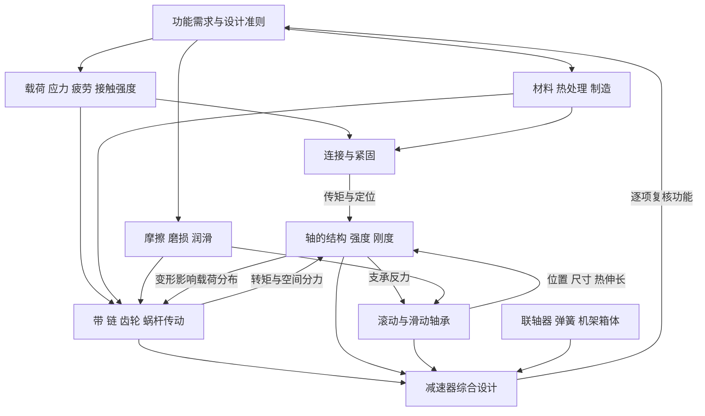

# 机械设计知识网络

这套网络以你提供的**濮良贵《机械设计》第十版**和**邱宣怀《机械设计》第四版**为依据，按“功能需求 → 失效机理 → 设计准则 → 计算模型 → 结构实现 → 系统校核”组织。章节是检索入口，跨章节的因果关系是复习主线。

**当前复习主入口：[[00-川大855真题驱动复习总图]]。**已合并两批真题资料，覆盖2000—2018、2021—2023共22个年份（含不完整回忆材料），按证据缩小学习范围，附[[01-历年真题证据索引]]与[[02-进阶变式与预测边界]]。本页及20专题保留作教材资料库，不再建议逐章平均复习。另见[[四川大学855模考卷-答案与详细解析]]及[[07-本卷考点与重点复习地图]]。历史频率不等同于当前大纲或未来命题概率。

## 从哪里开始

- [[01-两书章节与页码对照]]：找到同一主题在两本书中的位置。
- [[02-跨章节解题链]]：把零散章节连成受力、计算与结构问题。
- [[03-关键公式与适用条件]]：先判断模型，再查关系式与单位。
- [[04-复习路径与掌握检查]]：按依赖顺序复习，以输出能力检查掌握程度。
- [[机械设计知识网络.canvas]]：在 Obsidian 中缩放查看分层节点，沿带说明的连线跳转专题。
- [[05-错题与知识卡模板]]：把错题挂回知识点，而不只保存答案。
- [[06-资料依据与使用说明]]：查看版本、页码规则和核对范围。

## 六层结构

| 层次 | 核心问题 | 对应节点 |
|---|---|---|
| 功能与准则 | 做什么？可能怎样失效？按什么判断合格？ | [[01-设计准则与失效分析]] |
| 共用基础 | 应力、材料、摩擦和油膜如何决定工作能力？ | [[02-疲劳强度与接触强度]]、[[03-材料热处理与制造工艺]]、[[04-摩擦磨损与润滑]] |
| 连接 | 力和转矩怎样跨过零件接口？ | [[05-螺栓连接]]、[[06-螺旋传动]]、[[07-键花键与销连接]]、[[08-过盈铆焊胶连接]] |
| 传动 | 运动与功率怎样改变和传递？ | [[09-带传动]]、[[10-链传动]]、[[11-齿轮传动]]、[[12-蜗杆传动]]、[[20-摩擦轮与变速器]] |
| 轴系 | 传动载荷怎样传到支承，结构怎样保证工作？ | [[13-轴的结构与强度]]、[[14-滚动轴承]]、[[15-滑动轴承]]、[[16-联轴器与离合器]] |
| 系统与其他 | 全部零件怎样协调满足功能？ | [[17-弹簧]]、[[18-机架箱体与结构工艺]]、[[19-减速器与综合设计]] |

## 一张总图

图中箭头表示输入、约束或反馈，不代表所有主题必须严格按单一路径学习。

## 把所有零件放进同一个思考框架

每学一个零件，都闭卷回答七个问题：

1. 它完成什么功能，用什么机理传力？
2. 外载怎样作用，哪些截面或表面危险？
3. 可能怎样失效，主导失效随工况怎样变？
4. 用哪种设计准则，公式有哪些假设？
5. 哪些参数由计算确定，哪些必须选标准值？
6. 怎样装配、定位、润滑、密封和维护？
7. 它向相邻零件输出什么载荷，又受什么反馈约束？

## 三条贯穿全书的线

**力的路线**：功率与转速 → 转矩 → 传动件作用力 → 轴的内力 → 支承反力 → 轴承与箱体。

**失效的路线**：工况 → 应力或摩擦状态 → 失效 → 准则 → 尺寸与材料 → 校核。

**结构的路线**：装入 → 定心 → 周向固定 → 轴向定位 → 热伸长与调整 → 润滑密封 → 拆卸维护。

第一次使用时，先读“设计准则”，再进入“疲劳强度”；学完齿轮后，沿“齿轮 → 轴 → 滚动轴承 → 箱体 → 齿轮”的回路做一次综合复习。
