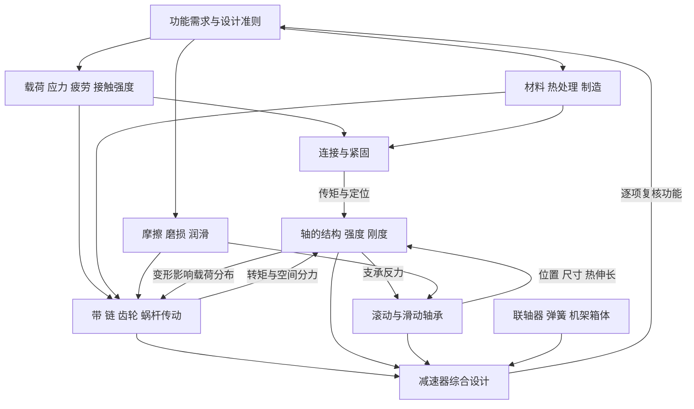

> 更新：本文件保留原教材全景版本。当前备考请优先使用 [[00-川大855真题驱动复习总图]]，按历史证据缩小范围。

---
tags: [机械设计, 知识地图]
---

# 机械设计知识网络

这套网络以你提供的**濮良贵《机械设计》第十版**和**邱宣怀《机械设计》第四版**为依据，按“功能需求 → 失效机理 → 设计准则 → 计算模型 → 结构实现 → 系统校核”组织。章节是检索入口，跨章节的因果关系是复习主线。

建议先用濮版建立主线，再用邱版补原理和专题。此安排是学习建议，并不代表院校指定的主教材或考试权重。尚未提供院校大纲和真题，因此不标注未经验证的“必考”“高频”或分值。

## 从哪里开始

- [[01-两书章节与页码对照]]：找到同一主题在两本书中的位置。
- [[02-跨章节解题链]]：把零散章节连成受力、计算与结构问题。
- [[03-关键公式与适用条件]]：先判断模型，再查关系式与单位。
- [[04-复习路径与掌握检查]]：按依赖顺序复习，以输出能力检查掌握程度。
- [[机械设计知识网络.canvas]]：在 Obsidian 中缩放查看分层节点，沿带说明的连线跳转专题。
- [[05-错题与知识卡模板]]：把错题挂回知识点，而不只保存答案。
- [[06-资料依据与使用说明]]：查看版本、页码规则和核对范围。

## 六层结构

| 层次 | 核心问题 | 对应节点 |
|---|---|---|
| 功能与准则 | 做什么？可能怎样失效？按什么判断合格？ | [[01-设计准则与失效分析]] |
| 共用基础 | 应力、材料、摩擦和油膜如何决定工作能力？ | [[02-疲劳强度与接触强度]]、[[03-材料热处理与制造工艺]]、[[04-摩擦磨损与润滑]] |
| 连接 | 力和转矩怎样跨过零件接口？ | [[05-螺栓连接]]、[[06-螺旋传动]]、[[07-键花键与销连接]]、[[08-过盈铆焊胶连接]] |
| 传动 | 运动与功率怎样改变和传递？ | [[09-带传动]]、[[10-链传动]]、[[11-齿轮传动]]、[[12-蜗杆传动]]、[[20-摩擦轮与变速器]] |
| 轴系 | 传动载荷怎样传到支承，结构怎样保证工作？ | [[13-轴的结构与强度]]、[[14-滚动轴承]]、[[15-滑动轴承]]、[[16-联轴器与离合器]] |
| 系统与其他 | 全部零件怎样协调满足功能？ | [[17-弹簧]]、[[18-机架箱体与结构工艺]]、[[19-减速器与综合设计]] |

## 一张总图

图中箭头表示输入、约束或反馈，不代表所有主题必须严格按单一路径学习。

## 把所有零件放进同一个思考框架

每学一个零件，都闭卷回答七个问题：

1. 它完成什么功能，用什么机理传力？
2. 外载怎样作用，哪些截面或表面危险？
3. 可能怎样失效，主导失效随工况怎样变？
4. 用哪种设计准则，公式有哪些假设？
5. 哪些参数由计算确定，哪些必须选标准值？
6. 怎样装配、定位、润滑、密封和维护？
7. 它向相邻零件输出什么载荷，又受什么反馈约束？

## 三条贯穿全书的线

**力的路线**：功率与转速 → 转矩 → 传动件作用力 → 轴的内力 → 支承反力 → 轴承与箱体。

**失效的路线**：工况 → 应力或摩擦状态 → 失效 → 准则 → 尺寸与材料 → 校核。

**结构的路线**：装入 → 定心 → 周向固定 → 轴向定位 → 热伸长与调整 → 润滑密封 → 拆卸维护。

第一次使用时，先读“设计准则”，再进入“疲劳强度”；学完齿轮后，沿“齿轮 → 轴 → 滚动轴承 → 箱体 → 齿轮”的回路做一次综合复习。

---

# 两书章节与页码对照

返回 [[00-机械设计知识网络总览]]

以下按知识主题对齐，不能按同一章号直接对应。表内页码为纸面印刷页码，链接定位到 PDF 页序。

| 主题 | 濮版第十版入口 | 邱版第四版入口 |
|---|---|---|
| [[01-设计准则与失效分析]] | [[《机械设计》濮良贵.pdf#page=15|濮良贵版 第2章，书内 p.5／PDF 15]] | [[《机械设计》邱宣怀.pdf#page=16|邱宣怀版 第1章，书内 p.1／PDF 16]]；[[《机械设计》邱宣怀.pdf#page=26|邱宣怀版 第2章，书内 p.11／PDF 26]] |
| [[02-疲劳强度与接触强度]] | [[《机械设计》濮良贵.pdf#page=37|濮良贵版 第3章，书内 p.27／PDF 37]] | [[《机械设计》邱宣怀.pdf#page=26|邱宣怀版 第2章，书内 p.11／PDF 26]]；[[《机械设计》邱宣怀.pdf#page=51|邱宣怀版 第3章，书内 p.36／PDF 51]] |
| [[03-材料热处理与制造工艺]] | [[《机械设计》濮良贵.pdf#page=31|濮良贵版 第2章，书内 p.21／PDF 31]] | [[《机械设计》邱宣怀.pdf#page=94|邱宣怀版 第5章，书内 p.79／PDF 94]] |
| [[04-摩擦磨损与润滑]] | [[《机械设计》濮良贵.pdf#page=63|濮良贵版 第4章，书内 p.53／PDF 63]] | [[《机械设计》邱宣怀.pdf#page=73|邱宣怀版 第4章，书内 p.58／PDF 73]] |
| [[05-螺栓连接]] | [[《机械设计》濮良贵.pdf#page=81|濮良贵版 第5章，书内 p.71／PDF 81]] | [[《机械设计》邱宣怀.pdf#page=115|邱宣怀版 第6章，书内 p.100／PDF 115]] |
| [[06-螺旋传动]] | [[《机械设计》濮良贵.pdf#page=113|濮良贵版 第5章，书内 p.103／PDF 113]] | [[《机械设计》邱宣怀.pdf#page=133|邱宣怀版 第6章，书内 p.118／PDF 133]] |
| [[07-键花键与销连接]] | [[《机械设计》濮良贵.pdf#page=125|濮良贵版 第6章，书内 p.115／PDF 125]] | [[《机械设计》邱宣怀.pdf#page=138|邱宣怀版 第7章，书内 p.123／PDF 138]] |
| [[08-过盈铆焊胶连接]] | [[《机械设计》濮良贵.pdf#page=139|濮良贵版 第7章，书内 p.129／PDF 139]] | [[《机械设计》邱宣怀.pdf#page=145|邱宣怀版 第8章，书内 p.130／PDF 145]]；[[《机械设计》邱宣怀.pdf#page=155|邱宣怀版 第9章，书内 p.140／PDF 155]] |
| [[09-带传动]] | [[《机械设计》濮良贵.pdf#page=165|濮良贵版 第8章，书内 p.155／PDF 165]] | [[《机械设计》邱宣怀.pdf#page=191|邱宣怀版 第11章，书内 p.176／PDF 191]] |
| [[10-链传动]] | [[《机械设计》濮良贵.pdf#page=187|濮良贵版 第9章，书内 p.177／PDF 187]] | [[《机械设计》邱宣怀.pdf#page=295|邱宣怀版 第14章，书内 p.280／PDF 295]] |
| [[11-齿轮传动]] | [[《机械设计》濮良贵.pdf#page=207|濮良贵版 第10章，书内 p.197／PDF 207]] | [[《机械设计》邱宣怀.pdf#page=219|邱宣怀版 第12章，书内 p.204／PDF 219]] |
| [[12-蜗杆传动]] | [[《机械设计》濮良贵.pdf#page=261|濮良贵版 第11章，书内 p.251／PDF 261]] | [[《机械设计》邱宣怀.pdf#page=272|邱宣怀版 第13章，书内 p.257／PDF 272]] |
| [[13-轴的结构与强度]] | [[《机械设计》濮良贵.pdf#page=381|濮良贵版 第15章，书内 p.371／PDF 381]] | [[《机械设计》邱宣怀.pdf#page=324|邱宣怀版 第16章，书内 p.309／PDF 324]] |
| [[14-滚动轴承]] | [[《机械设计》濮良贵.pdf#page=327|濮良贵版 第13章，书内 p.317／PDF 327]] | [[《机械设计》邱宣怀.pdf#page=374|邱宣怀版 第18章，书内 p.359／PDF 374]] |
| [[15-滑动轴承]] | [[《机械设计》濮良贵.pdf#page=295|濮良贵版 第12章，书内 p.285／PDF 295]] | [[《机械设计》邱宣怀.pdf#page=348|邱宣怀版 第17章，书内 p.333／PDF 348]] |
| [[16-联轴器与离合器]] | [[《机械设计》濮良贵.pdf#page=363|濮良贵版 第14章，书内 p.353／PDF 363]] | [[《机械设计》邱宣怀.pdf#page=419|邱宣怀版 第19章，书内 p.404／PDF 419]] |
| [[17-弹簧]] | [[《机械设计》濮良贵.pdf#page=411|濮良贵版 第16章，书内 p.401／PDF 411]] | [[《机械设计》邱宣怀.pdf#page=446|邱宣怀版 第20章，书内 p.431／PDF 446]] |
| [[18-机架箱体与结构工艺]] | [[《机械设计》濮良贵.pdf#page=431|濮良贵版 第17章，书内 p.421／PDF 431]] | [[《机械设计》邱宣怀.pdf#page=470|邱宣怀版 第21章，书内 p.455／PDF 470]] |
| [[19-减速器与综合设计]] | [[《机械设计》濮良贵.pdf#page=439|濮良贵版 第18章，书内 p.429／PDF 439]] | [[《机械设计》邱宣怀.pdf#page=312|邱宣怀版 第15章，书内 p.297／PDF 312]] |
| [[20-摩擦轮与变速器]] | [[《机械设计》濮良贵.pdf#page=443|濮良贵版 第18章，书内 p.433／PDF 443]] | [[《机械设计》邱宣怀.pdf#page=178|邱宣怀版 第10章，书内 p.163／PDF 178]] |

## 需要重点对读的差异

- 设计基础：濮版第2—3章，对照邱版第1—3章；邱版将工作能力与疲劳强度分开展开。
- 材料与工艺：濮版 §2-9 及零件章节，对照邱版第5章的独立专题。
- 过盈连接：濮版 §7-4，对照邱版第8章；无键连接还需看濮版 §6-3。
- 带传动：濮版第8章主线之外，可从邱版 §11.6—11.9 补平带、同步带等分支。
- 摩擦轮与变速：濮版 §18-2—18-3，对照邱版第10章；减速器则对照邱版第15章。
- 轴系编排不同：濮版先轴承、后轴；邱版先轴、后轴承。复习时建议先有轴的受力和结构概念，再完成轴承计算，最后回到联合设计。
- 记号可能不同：例如螺栓总拉力、预紧力；做题前按物理含义建立记号对照。设计系数、许用值与配套表格不跨版本混用。

## 原书全部章级入口

### 濮良贵版：18章

- [[《机械设计》濮良贵.pdf#page=13|濮良贵版 第1章，书内 p.3／PDF 13]]：绪论
- [[《机械设计》濮良贵.pdf#page=15|濮良贵版 第2章，书内 p.5／PDF 15]]：机械设计总论
- [[《机械设计》濮良贵.pdf#page=37|濮良贵版 第3章，书内 p.27／PDF 37]]：机械零件的强度
- [[《机械设计》濮良贵.pdf#page=63|濮良贵版 第4章，书内 p.53／PDF 63]]：摩擦、磨损及润滑概述
- [[《机械设计》濮良贵.pdf#page=81|濮良贵版 第5章，书内 p.71／PDF 81]]：螺纹连接和螺旋传动
- [[《机械设计》濮良贵.pdf#page=125|濮良贵版 第6章，书内 p.115／PDF 125]]：键、花键、无键连接和销连接
- [[《机械设计》濮良贵.pdf#page=139|濮良贵版 第7章，书内 p.129／PDF 139]]：铆接、焊接、胶接和过盈连接
- [[《机械设计》濮良贵.pdf#page=165|濮良贵版 第8章，书内 p.155／PDF 165]]：带传动
- [[《机械设计》濮良贵.pdf#page=187|濮良贵版 第9章，书内 p.177／PDF 187]]：链传动
- [[《机械设计》濮良贵.pdf#page=207|濮良贵版 第10章，书内 p.197／PDF 207]]：齿轮传动
- [[《机械设计》濮良贵.pdf#page=261|濮良贵版 第11章，书内 p.251／PDF 261]]：蜗杆传动
- [[《机械设计》濮良贵.pdf#page=295|濮良贵版 第12章，书内 p.285／PDF 295]]：滑动轴承
- [[《机械设计》濮良贵.pdf#page=327|濮良贵版 第13章，书内 p.317／PDF 327]]：滚动轴承
- [[《机械设计》濮良贵.pdf#page=363|濮良贵版 第14章，书内 p.353／PDF 363]]：联轴器和离合器
- [[《机械设计》濮良贵.pdf#page=381|濮良贵版 第15章，书内 p.371／PDF 381]]：轴
- [[《机械设计》濮良贵.pdf#page=411|濮良贵版 第16章，书内 p.401／PDF 411]]：弹簧
- [[《机械设计》濮良贵.pdf#page=431|濮良贵版 第17章，书内 p.421／PDF 431]]：机架和箱体简介
- [[《机械设计》濮良贵.pdf#page=439|濮良贵版 第18章，书内 p.429／PDF 439]]：减速器和变速器

### 邱宣怀版：21章

- [[《机械设计》邱宣怀.pdf#page=16|邱宣怀版 第1章，书内 p.1／PDF 16]]：机械设计概论
- [[《机械设计》邱宣怀.pdf#page=26|邱宣怀版 第2章，书内 p.11／PDF 26]]：机械零件的工作能力和计算准则
- [[《机械设计》邱宣怀.pdf#page=51|邱宣怀版 第3章，书内 p.36／PDF 51]]：机械零件的疲劳强度
- [[《机械设计》邱宣怀.pdf#page=73|邱宣怀版 第4章，书内 p.58／PDF 73]]：摩擦、磨损、润滑
- [[《机械设计》邱宣怀.pdf#page=94|邱宣怀版 第5章，书内 p.79／PDF 94]]：机械常用材料和制造工艺性
- [[《机械设计》邱宣怀.pdf#page=115|邱宣怀版 第6章，书内 p.100／PDF 115]]：螺纹联接
- [[《机械设计》邱宣怀.pdf#page=138|邱宣怀版 第7章，书内 p.123／PDF 138]]：键、花键、销、成形联接
- [[《机械设计》邱宣怀.pdf#page=145|邱宣怀版 第8章，书内 p.130／PDF 145]]：过盈联接
- [[《机械设计》邱宣怀.pdf#page=155|邱宣怀版 第9章，书内 p.140／PDF 155]]：铆接、焊接、胶接
- [[《机械设计》邱宣怀.pdf#page=178|邱宣怀版 第10章，书内 p.163／PDF 178]]：摩擦轮传动
- [[《机械设计》邱宣怀.pdf#page=191|邱宣怀版 第11章，书内 p.176／PDF 191]]：带传动
- [[《机械设计》邱宣怀.pdf#page=219|邱宣怀版 第12章，书内 p.204／PDF 219]]：齿轮传动
- [[《机械设计》邱宣怀.pdf#page=272|邱宣怀版 第13章，书内 p.257／PDF 272]]：蜗杆传动
- [[《机械设计》邱宣怀.pdf#page=295|邱宣怀版 第14章，书内 p.280／PDF 295]]：链传动
- [[《机械设计》邱宣怀.pdf#page=312|邱宣怀版 第15章，书内 p.297／PDF 312]]：减速器
- [[《机械设计》邱宣怀.pdf#page=324|邱宣怀版 第16章，书内 p.309／PDF 324]]：轴
- [[《机械设计》邱宣怀.pdf#page=348|邱宣怀版 第17章，书内 p.333／PDF 348]]：滑动轴承
- [[《机械设计》邱宣怀.pdf#page=374|邱宣怀版 第18章，书内 p.359／PDF 374]]：滚动轴承
- [[《机械设计》邱宣怀.pdf#page=419|邱宣怀版 第19章，书内 p.404／PDF 419]]：联轴器和离合器
- [[《机械设计》邱宣怀.pdf#page=446|邱宣怀版 第20章，书内 p.431／PDF 446]]：弹簧
- [[《机械设计》邱宣怀.pdf#page=470|邱宣怀版 第21章，书内 p.455／PDF 470]]：机架零件

本表覆盖两书全部章级主题；各章细节在专题卡中列出复习分支，完整小节名称仍以原书目录为准。

---

# 跨章节解题链

返回 [[00-机械设计知识网络总览]]

## 1. 齿轮—轴—轴承—箱体

[[19-减速器与综合设计]] → [[11-齿轮传动]] → [[13-轴的结构与强度]] → [[14-滚动轴承]] → [[18-机架箱体与结构工艺]]。

| 步骤 | 需要输入 | 应交付的结果 | 典型漏项 |
|---|---|---|---|
| 动力分配 | 功率、转速、传动比、效率 | 每根轴的 P、n、T | 将输入功率代入所有轴段 |
| 齿轮受力 | 转矩、几何、旋向、转向 | 啮合处各分力及方向 | 斜齿遗漏轴向力 |
| 轴受力 | 力的位置与支承布置 | 两平面反力、弯矩及转矩图 | 力正确但作用位置错误 |
| 轴校核 | 危险截面、材料、循环、结构细节 | 强度、必要的疲劳和刚度结论 | 只看最大弯矩，忽略键槽 |
| 轴承选择 | 各支承径向力、轴向配置、转速 | 当量载荷与寿命、类型及安装 | 外轴向力简单平分 |
| 结构闭环 | 轴径、轴承、轮毂和箱体空间 | 定位、装拆、润滑、密封 | 零件各自合格却装不进去 |

必须回看：支承跨距或轴承型号变化→轴的反力、变形可能变化；轴与箱体变形→齿轮偏载可能变化。综合题是一组相互约束的计算。

## 2. 预紧螺栓—连接刚度—疲劳

[[05-螺栓连接]] → [[02-疲劳强度与接触强度]] → [[03-材料热处理与制造工艺]]。

外载变化 → 由螺栓和被连接件刚度确定螺栓拉力变化 → 得到应力幅与平均应力 → 选择疲劳模型 → 同时检查残余夹紧力及最大总拉力。

说明改善措施时写出机制：“降低螺栓相对刚度→相同外载变化下总拉力幅减小→改善疲劳条件”，随后检查密封、防分离和静强度是否仍满足。不要把“预紧越大越好”当结论。

## 3. 摩擦传动—预紧或压紧—支承寿命

[[04-摩擦磨损与润滑]] → [[09-带传动]] / [[20-摩擦轮与变速器]] → [[13-轴的结构与强度]] → [[14-滚动轴承]]。

提高初拉力或压紧力，可以提高摩擦传力能力；同时增大轴与支承负担。在转速和额定动载荷不变的寿命模型中，当量载荷增加会使疲劳寿命下降。因此传动件的局部优化需要在轴系中复核。

## 4. 蜗杆—效率—温升—润滑

[[12-蜗杆传动]] → [[04-摩擦磨损与润滑]] → [[18-机架箱体与结构工艺]]。

滑动与摩擦 → 功率损失 → 发热 → 油温 → 黏度和油膜 → 摩擦与磨损。通过箱体表面、散热措施和供油方式与外界交换热量。

计算时先算强度，再算效率与热平衡；发现温度条件不合适，应修改方案并复核。不要把热平衡当成强度公式里的一个安全系数。

## 5. 键—轴肩—装配—疲劳

[[07-键花键与销连接]] → [[13-轴的结构与强度]] → [[02-疲劳强度与接触强度]]。

轮毂需要周向固定 → 选键并验算工作面 → 键槽与轴肩改变危险截面 → 轴的疲劳校核 → 圆角、轴肩高度和套筒等结构满足装配与定位。

结构改错按照“径向定心、周向传矩、轴向定位、装配通路、拆卸维护”分别检查；不能用一个键替代所有定位功能。

## 6. 滑动轴承—油膜—温度反馈

[[15-滑动轴承]] ↔ [[04-摩擦磨损与润滑]]，同时连接 [[13-轴的结构与强度]]。

载荷与转速 → 间隙和油楔 → 油膜承载与最小厚度 → 流量和摩擦功耗 → 热平衡及黏度 → 返回油膜计算。轴的变形和表面粗糙度也会影响有效工作间隙。

区分“平均压强或 pv 合格”与“最小油膜厚度足以分隔两表面”，它们回答不同问题。

## 自编贯通小练习：同一动力链上的三种数值

以下是学习用的自编简化练习，不是原书例题或院校真题。

某轴传递功率 P=5 kW，转速 n=500 r/min；轴上直齿圆柱齿轮分度圆直径 d=100 mm。齿轮位于两个支承的中点，跨距200 mm。只先计算圆周力所在平面的效应；忽略其他载荷。

1. 转矩 T≈9550×5/500=95.5 N·m=95500 N·mm。
2. 齿轮圆周力 Ft=2T/d=2×95500/100=1910 N。
3. 在该平面，两端支承反力各为955 N，中点最大弯矩为1910×200/4=95500 N·mm。

注意：第三步只是一个平面的结果。完整轴设计还要加入压力角决定的径向分力及其他载荷，在另一平面求弯矩后合成；斜齿还需处理轴向分力相关作用。

另设某球轴承已经按完整受力模型得到当量动载荷 Pb=2000 N、额定动载荷 C=20000 N，n=500 r/min。在基本寿命模型下，L10h=10^6/(60×500)×(20000/2000)^3≈33333 h。此 Pb 是额外给定，不能从上面单平面反力直接得到。

若仅 Pb 翻倍而 C、n 不变，寿命变成原来的1/8。这说明受力分析的误差会被寿命指数放大。

---

# 关键公式与适用条件

返回 [[00-机械设计知识网络总览]]

这里只保留能串起知识网络的关系式。齿轮、带、链、蜗杆等完整设计式及各种系数，应回原书查对应图表；本表不能替代教材公式体系。以下统一书写记号，跨书使用先对齐物理意义。

## 1. 动力与受力入口

$$T\approx9550\frac{P}{n}\quad(\mathrm{N\cdot m})$$

P 用 kW，n 用 r/min；若 T 用 N·mm，系数为 $9.55\times10^6$。见 [[《机械设计》濮良贵.pdf#page=391|濮版 p.381／PDF 391]]。本式处理对应轴段的功率，先计入各级效率。

$$F_t=\frac{2T}{d}$$

T 与 d 的长度单位配套：N·mm 与 mm，或 N·m 与 m，结果为 N。用于相应圆周上转矩和圆周力的换算。齿轮见濮版 §10-4、邱版 §12.6。

$$P=\frac{F_ev}{1000},\qquad F_e=F_{\mathrm{紧}}-F_{\mathrm{松}}$$

P 为 kW，力为 N，速度为 m/s。用于带传动有效拉力与功率的换算；有效拉力不等于轴上载荷。见 [[《机械设计》濮良贵.pdf#page=169|濮版 p.159／PDF 169]]。

## 2. 应力循环

$$\sigma_m=\frac{\sigma_{\max}+\sigma_{\min}}{2},\quad
\sigma_a=\frac{\sigma_{\max}-\sigma_{\min}}{2},\quad
r=\frac{\sigma_{\min}}{\sigma_{\max}}$$

对称循环 r=-1，脉动循环通常指 r=0；r 的比值定义要求分母非零。疲劳计算还需要零件修正因素与应力增长规律。不能只凭 r 直接选任意安全系数公式。见濮版第3章、邱版第2—3章，特别是 [[《机械设计》邱宣怀.pdf#page=61|邱版 p.46／PDF 61 的增长路径]]。

## 3. 预紧连接的载荷分配

统一采用濮版物理记号：F₀=预紧力，F=工作拉力，F₁=残余预紧力，F₂=总拉力。记 $\chi=C_b/(C_b+C_m)$，其中 $C_b,C_m$ 为螺栓和被连接件刚度。

$$F_2=F_0+\chi F,\qquad F_1=F_0-(1-\chi)F,\qquad F_2=F_1+F$$

适用：常用轴向载荷、接合面保持接触且零件处于线弹性范围的简化模型。一旦接合面分离，不能继续按此分配。

若外力在 $F_{\min}$ 与 $F_{\max}$ 间变化，则

$$F_{2a}=\chi\frac{F_{\max}-F_{\min}}2$$

它连接“结构刚度”与“疲劳应力幅”。原书受力图见 [[《机械设计》濮良贵.pdf#page=101|濮版 p.91—93（从PDF 101进入）]]，疲劳说明见 [[《机械设计》邱宣怀.pdf#page=123|邱版 p.108／PDF 123]]。邱版相关公式记号不同，先辨含义。

## 4. 带的摩擦极限

$$\frac{F_{\mathrm{紧}}}{F_{\mathrm{松}}}=e^{f\alpha}$$

这是教材简化摩擦模型中达到临界打滑状态的关系，不能对任意工作状态都直接取等号。包角 $\alpha$ 用弧度；V带采用相应当量摩擦系数；拉力定义及离心效应处理应保持与原式一致。见 [[《机械设计》濮良贵.pdf#page=169|濮版 p.159／PDF 169]]。

## 5. 普通平键连接的载荷与承压

$$F_t=\frac{2T}{d},\qquad p=\frac{F_t}{k\,l}\le[p]$$

k 是有效工作高度，l 是有效工作长度。须按键型和端部形式确定有效尺寸，不能无条件用名义全长；N、mm 体系下 p 为 MPa。主要用于普通平键静连接的挤压校核，动连接等按原书选择磨损或其他准则。见濮版 §6-1、邱版 §7.1。

## 6. 轴的弯扭组合：先得到内力

$$M=\sqrt{M_y^2+M_z^2}$$

这是同一截面两个正交平面弯矩的合成。之后的当量弯矩、应力或安全系数计算，还需要扭矩、截面、应力循环与所选强度理论。不要把两个平面各自的最大弯矩（可能发生在不同位置）直接合成。见濮版 §15-3、邱版 §16.3。

## 7. 滚动轴承基本额定寿命

$$L_{10}=\left(\frac{C}{P_b}\right)^\varepsilon\quad(10^6\mathrm{\ revolutions})$$

$$L_{10h}=\frac{10^6}{60n}\left(\frac{C}{P_b}\right)^\varepsilon$$

球轴承 $\varepsilon=3$，滚子轴承 $\varepsilon=10/3$；C 和 $P_b$ 使用相同力单位；n 为 r/min，小时寿命为 h。本表以 $P_b$ 表示当量动载荷，避免与功率 P 混淆。

常用基本模型中 $P_b=XF_r+YF_a$，X、Y 根据轴承类型与表格条件选取；温度、载荷工况、可靠度等修正按原书和题设处理。本式不代表任意工况的实际保证寿命。

依据：[[《机械设计》濮良贵.pdf#page=338|濮版 p.328 的统计含义]]、[[《机械设计》濮良贵.pdf#page=340|濮版 p.330 的寿命与当量载荷公式]]、[[《机械设计》邱宣怀.pdf#page=387|邱版 p.372 的定义]]。

## 8. 径向滑动轴承的条件性计算

$$p=\frac{F_r}{dB},\qquad v=\frac{\pi dn}{60000}$$

d、B 用 mm，$F_r$ 用 N，p 得 MPa；n 用 r/min，v 得 m/s。再按教材和工况检查 $p\le[p]$、$pv\le[pv]$ 及必要的速度限制。

适用：对应径向轴承的平均压强及条件性验算。推力轴承承压面积不同，不能直接套此式；也不能凭此确认完整油膜。参见濮版 §12-6、邱版 §17.7。

## 9. 传动链功率与转速

$$n_{j+1}=\frac{n_j}{i_j},\quad P_{j+1}=\eta_jP_j,\quad T_{j+1}\approx i_j\eta_jT_j$$

这里定义 $i_j=n_j/n_{j+1}$，且效率对应同一传动区段。不计损失时才令效率为1；若表中已把轴承等损失计入级效率，不能重复扣除。用于 [[19-减速器与综合设计]] 的参数表。

## 10. 热平衡的能量关系

$$\dot Q_{\mathrm{发}}\approx1000P_{\mathrm{入}}(1-\eta),\qquad
\dot Q_{\mathrm{散}}\approx hA(\theta-\theta_0)$$

第一式 P 用 kW，热流率用 W；第二式是简化稳态散热模型，h 用 W/(m²·K)，A 用 m²，温差用 K 或数值相同的 ℃差。必须明确效率和散热模型覆盖的系统边界，不能漏掉或重复计入损失。

用于理解蜗杆及箱体热平衡，具体换热系数、面积和附加冷却按原书。参见濮版 §11-5、邱版 §13.8。

## 代公式之前的四项检查

1. 这个公式解决的失效或功能是什么？
2. 模型中的力、几何和应力状态与题目一致吗？
3. 参数单位和物理记号一致吗？
4. 系数与许用值是否来自配套教材、表格和题设？

---

# 复习路径与掌握检查

返回 [[00-机械设计知识网络总览]]

按知识依赖给出学习顺序；这不是对院校考频的判断。未明确考试范围前保留全部主题，明确大纲后再调整深度。

## 第一轮：建模与主干

| 阶段 | 学习节点 | 本阶段结束时必须交付 |
|---|---|---|
| 1 共用语言 | 设计准则→疲劳与接触→材料→摩擦润滑 | 一张“失效—准则—典型零件”表，能识别应力循环 |
| 2 连接建模 | 螺栓→螺旋→键；再比较其他连接 | 一张螺栓受力图，一份周向与轴向固定对照 |
| 3 传动分析 | 带→链→齿轮→蜗杆；补摩擦轮 | 一张传动方式比较表，能从转矩推到空间分力 |
| 4 轴系闭环 | 轴初步→滚动轴承→返回轴结构；再学滑动轴承 | 一套两平面弯矩图和轴承载荷计算，解释润滑分支 |
| 5 系统综合 | 联轴器→机架箱体→减速器，结合弹簧 | 一份“动力参数—零件载荷—轴系—结构”串联答案 |

每个节点先用濮版阅读概念和例题，再按疑问到邱版对应节补充。两书对读以解决一个具体问题为单位，不要求重复通读全部相同内容。

## 第二轮：按题目输出组织

- 概念辨析：弹性滑动/打滑；强度/刚度；点蚀/胶合；额定寿命/实际寿命；预紧力/总拉力；动压/静压。
- 受力计算：螺栓组、齿轮空间分力、蜗杆副分力、轴两平面反力、轴承轴向力。
- 设计校核：先写失效与准则，再写模型、求值、选标准参数并回算。
- 结构改错：定心、传矩、定位、装拆、热伸长、润滑密封逐项检查。
- 参数影响：某参数改变后，沿网络至少追踪到两个后续节点，而不是只描述本公式。

这些是本知识体系的练习分类，不宣称某院校一定采用这些题型。

## 第三轮：用闭卷回忆检查

一个节点有四个掌握等级：

| 等级 | 能力表现 | 下一步 |
|---|---|---|
| 0 未建模 | 只能认出术语 | 看概念和基本图，口述功能 |
| 1 能解释 | 说出原理、失效、准则 | 做一题完整计算或结构分析 |
| 2 能求解 | 独立解代表题，说明单位与条件 | 做变式，接到相邻节点 |
| 3 能迁移 | 改变工况后能重新判断并解释跨章后果 | 混合练习及限时复盘 |

复习记录每次只记：日期、节点、等级、一个最薄弱问题、下一次回忆内容。先尝试闭卷回忆，再看答案。

## 全局闭卷检查

- [ ] 能从失效形式选择强度、刚度、耐磨或热平衡准则。
- [ ] 能区分静载荷与材料点的静应力。
- [ ] 能解释疲劳极限修正与增长路径。
- [ ] 能区分普通螺栓和铰制孔螺栓的横向传力模型。
- [ ] 能画出预紧连接的力与变形关系。
- [ ] 能解释键的工作面、有效长度和定位功能。
- [ ] 能区分带的弹性滑动、打滑和链的多边形效应。
- [ ] 能为齿轮选择主算与校核准则，并求分力。
- [ ] 能解释蜗杆强度、刚度与热平衡三类约束。
- [ ] 能画轴的两平面弯矩图，识别危险截面。
- [ ] 能从支承受力求轴承当量载荷与寿命。
- [ ] 能处理有内部轴向作用的轴承配置问题。
- [ ] 能区分滑动轴承条件性计算与动压油膜计算。
- [ ] 能解释联轴器、离合器与弹簧的功能及选型约束。
- [ ] 能把减速器中每处定位、润滑、密封结构与功能对应。

## 得到院校大纲后怎样细化

建立“官方大纲条目—本网络节点—指定书节—历年题号—当前掌握等级”的对照表。先确认参考书版本、考试范围和题型，再据真题证据排序；不以通用经验代替院校实际要求。

---

---
tags: [机械设计, 基础]
掌握状态: 未开始
---

# 设计准则与失效分析

返回 [[00-机械设计知识网络总览]] · 对照 [[01-两书章节与页码对照]]

## 教材入口

- [[《机械设计》濮良贵.pdf#page=15|濮良贵版 第2章，书内 p.5／PDF 15]]
- [[《机械设计》邱宣怀.pdf#page=16|邱宣怀版 第1章，书内 p.1／PDF 16]]
- [[《机械设计》邱宣怀.pdf#page=26|邱宣怀版 第2章，书内 p.11／PDF 26]]

入口为该章或相关节的起始页；本卡为依据教材主题编写的复习提纲，不是逐页摘录。复习时在原书核对推导、图表和适用条件。

## 核心知识与解题路径

机械设计的入口是使用要求：传递多少功率、承受什么载荷、工作多久、允许多大变形，以及怎样制造、装配和维护。先把要求变成约束，再选择结构与计算模型。

知识分支：机器与零件 → 设计程序 → 载荷和应力 → 失效形式 → 工作能力准则 → 设计计算与校核计算 → 标准化、可靠性。

对应关系必须说清楚：断裂或塑性变形对应强度；过大弹性变形对应刚度；磨损对应耐磨性；温升过高对应热平衡；振动问题对应振动稳定性。一个零件可能同时受多个准则限制。

设计计算是在载荷、材料和约束已知时求尺寸；校核计算是在尺寸与材料已知时验证是否满足要求。实际过程通常是“初算—选标准尺寸—结构设计—重新校核”。

静载荷不等于静应力。必须跟踪零件上一个材料点的应力历程，例如空间方向不变的横向力作用于旋转轴，材料点仍可能承受交变弯曲应力。

## 在知识网络中的联系

- [[17-弹簧]] → 本节点：刚度与变形必须满足功能。
- 本节点 → [[02-疲劳强度与接触强度]]：由失效准则确定强度计算。
- 本节点 → [[03-材料热处理与制造工艺]]：按功能与失效选择材料。
- 本节点 → [[04-摩擦磨损与润滑]]：由工作条件选择耐磨与润滑准则。

## 闭卷自测

1. 给出轴、齿轮和滑动轴承各一种失效，并选择对应准则。
2. 为什么强度合格的轴仍可能不能正常工作？
3. 设计计算后将直径圆整，为什么还要校核？

展开参考要点

1. 轴疲劳断裂→疲劳强度；齿面点蚀→接触疲劳强度；轴瓦磨损→条件性耐磨验算或润滑设计。
2. 挠度或转角过大可能使啮合和支承工作不良；必要时还要检查振动稳定性。
3. 圆整和结构细化会改变截面、应力集中、配合及有关参数。

## 本轮复习记录

- [ ] 能解释原理和失效
- [ ] 能判断公式的适用条件
- [ ] 能独立完成代表题或结构分析
- [ ] 能说出至少两条跨章联系

错题链接：

下次回忆时最需要回答的问题：

---

---
tags: [机械设计, 基础]
掌握状态: 未开始
---

# 疲劳强度与接触强度

返回 [[00-机械设计知识网络总览]] · 对照 [[01-两书章节与页码对照]]

## 教材入口

- [[《机械设计》濮良贵.pdf#page=37|濮良贵版 第3章，书内 p.27／PDF 37]]
- [[《机械设计》邱宣怀.pdf#page=26|邱宣怀版 第2章，书内 p.11／PDF 26]]
- [[《机械设计》邱宣怀.pdf#page=51|邱宣怀版 第3章，书内 p.36／PDF 51]]

入口为该章或相关节的起始页；本卡为依据教材主题编写的复习提纲，不是逐页摘录。复习时在原书核对推导、图表和适用条件。

## 核心知识与解题路径

知识分支：应力循环 → 疲劳曲线 → 极限应力图 → 零件疲劳极限修正 → 工作应力增长规律 → 安全系数 → 变幅载荷累积损伤；另有接触强度、断裂和可靠性分支。

先算平均应力、应力幅和循环特性，再看危险截面。光滑小试件的疲劳极限不能直接当作真实零件的疲劳极限：应力集中、尺寸、表面状态等需要按所用教材修正。

极限应力图题的关键是增长路径。r 保持不变、平均应力保持不变、最小应力保持不变，通向极限边界的路径不同，安全系数公式不能混用。邱版 §3.4.3—3.5 对这条逻辑展开较清楚。

接触疲劳与弯曲疲劳都由重复载荷引起，但危险位置和计算模型不同：齿面、滚道关注接触应力；齿根和轴肩关注弯曲应力与应力集中。接触应力也不能直接用平均挤压应力替代。

解题步骤：画应力循环→求应力参数→确定材料和修正因素→辨别增长规律→求安全系数→检查是否还受静强度限制。变幅问题另辨别载荷谱、循环次数与累积损伤模型。

## 在知识网络中的联系

- [[01-设计准则与失效分析]] → 本节点：由失效准则确定强度计算。
- [[03-材料热处理与制造工艺]] → 本节点：材料、表面和制造影响疲劳极限。
- [[05-螺栓连接]] → 本节点：连接刚度改变螺栓应力幅。
- 本节点 → [[05-螺栓连接]]：变载螺栓需要疲劳评价。
- 本节点 → [[11-齿轮传动]]：齿根弯曲与齿面接触疲劳。
- 本节点 → [[13-轴的结构与强度]]：轴肩键槽影响疲劳安全系数。
- 本节点 → [[14-滚动轴承]]：接触疲劳引出额定寿命。
- 本节点 → [[17-弹簧]]：变载弹簧需要疲劳评价。

## 闭卷自测

1. 恒定横向力作用下匀速旋转轴的弯曲应力通常是什么循环？
2. 轴肩圆角增大主要改善哪一环节？
3. 工作应力增长时为什么不能一律沿原点射线？

展开参考要点

1. 对随轴旋转的表面材料点，在通常简化模型中为对称循环。
2. 减轻应力集中；还需保证与相邻零件倒角、定位结构相容。
3. 只有 r 不变时平均应力与应力幅同比增长；其他约束对应其他路径。

## 本轮复习记录

- [ ] 能解释原理和失效
- [ ] 能判断公式的适用条件
- [ ] 能独立完成代表题或结构分析
- [ ] 能说出至少两条跨章联系

错题链接：

下次回忆时最需要回答的问题：

---

---
tags: [机械设计, 基础]
掌握状态: 未开始
---

# 材料热处理与制造工艺

返回 [[00-机械设计知识网络总览]] · 对照 [[01-两书章节与页码对照]]

## 教材入口

- [[《机械设计》濮良贵.pdf#page=31|濮良贵版 第2章，书内 p.21／PDF 31]]
- [[《机械设计》邱宣怀.pdf#page=94|邱宣怀版 第5章，书内 p.79／PDF 94]]

入口为该章或相关节的起始页；本卡为依据教材主题编写的复习提纲，不是逐页摘录。复习时在原书核对推导、图表和适用条件。

## 核心知识与解题路径

知识分支：材料力学性能 → 材料选择 → 热处理 → 毛坯与制造 → 公差配合 → 表面粗糙度 → 工艺性与经济性。

选材从失效倒推：需要耐接触疲劳与耐磨时关注表层性能；承受冲击和弯曲时同时考虑心部韧性。齿轮的材料与热处理会改变许用应力及设计准则的侧重点。

强度、硬度、刚度分别理解。提高钢的强度或硬度，不意味着弹性模量随之大幅提高；刚度问题常需通过直径、跨距、截面形状及支承布局解决。

零件图中的配合、粗糙度、圆角、退刀槽和装配倒角都有功能。轴承配合影响安装及套圈工作；键槽影响传矩与轴的疲劳强度；齿面精度影响动载荷。

两书分工：濮版 §2-9 建立选材入口，邱版第5章系统补充毛坯、公差配合、粗糙度与制造工艺性。旧版材料牌号和表格按题目指定资料使用，不跨版本拼接系数。

## 在知识网络中的联系

- [[01-设计准则与失效分析]] → 本节点：按功能与失效选择材料。
- [[08-过盈铆焊胶连接]] → 本节点：连接工艺影响材料和制造选择。
- 本节点 → [[02-疲劳强度与接触强度]]：材料、表面和制造影响疲劳极限。
- 本节点 → [[11-齿轮传动]]：热处理改变许用应力与准则侧重。
- 本节点 → [[13-轴的结构与强度]]：材料和工艺约束轴的结构。

## 闭卷自测

1. 提高轴的材料强度能否直接解决挠度过大？
2. 齿轮为什么可能要求表面硬而心部有韧性？
3. 为什么设计时要考虑刀具退出与装配顺序？

展开参考要点

1. 一般不能；需检查几何尺寸、支承布局以及弹性模量。
2. 表面承受接触和磨损，心部承担弯曲并抵抗冲击。
3. 结构必须能加工、能装入、能定位并能拆卸维护。

## 本轮复习记录

- [ ] 能解释原理和失效
- [ ] 能判断公式的适用条件
- [ ] 能独立完成代表题或结构分析
- [ ] 能说出至少两条跨章联系

错题链接：

下次回忆时最需要回答的问题：

---

---
tags: [机械设计, 基础]
掌握状态: 未开始
---

# 摩擦磨损与润滑

返回 [[00-机械设计知识网络总览]] · 对照 [[01-两书章节与页码对照]]

## 教材入口

- [[《机械设计》濮良贵.pdf#page=63|濮良贵版 第4章，书内 p.53／PDF 63]]
- [[《机械设计》邱宣怀.pdf#page=73|邱宣怀版 第4章，书内 p.58／PDF 73]]

入口为该章或相关节的起始页；本卡为依据教材主题编写的复习提纲，不是逐页摘录。复习时在原书核对推导、图表和适用条件。

## 核心知识与解题路径

知识分支：摩擦状态 → 磨损类型 → 润滑剂与黏度 → 供油方式 → 流体润滑 → 温度、密封与维护。

摩擦既可被利用，也会造成损失。带传动、摩擦轮、摩擦离合器、普通螺栓横向连接依靠摩擦传力；齿轮、轴承中的摩擦通常需要控制，以减少发热和磨损。

区分磨粒磨损、黏着磨损、疲劳磨损等机理。齿面胶合与润滑膜破坏及局部温升相关；点蚀属于接触疲劳问题，不能与胶合混称。

润滑状态由速度、载荷、黏度、间隙、表面状态等共同决定。提高黏度可能有利于形成油膜，也可能增加黏性损失和温升，因此“越黏越好”不成立。

动压润滑的典型入口是收敛间隙、适当相对运动、足量且有黏度的润滑剂。静压润滑依靠外部供压；动压轴承启动、停车时不能默认一直有完整承载油膜。

跨章检查：润滑剂能否到达工作面？油沟是否破坏主要承载区？杂质怎样被挡住？发出的热怎样散走？

## 在知识网络中的联系

- [[01-设计准则与失效分析]] → 本节点：由工作条件选择耐磨与润滑准则。
- [[06-螺旋传动]] → 本节点：当量摩擦决定效率与自锁。
- [[14-滚动轴承]] → 本节点：润滑密封影响轴承实际工作。
- [[15-滑动轴承]] → 本节点：油温改变黏度并反馈油膜。
- [[16-联轴器与离合器]] → 本节点：摩擦离合器需要摩擦和热分析。
- 本节点 → [[09-带传动]]：摩擦能力限制有效拉力。
- 本节点 → [[15-滑动轴承]]：油膜形成决定计算路径。
- 本节点 → [[12-蜗杆传动]]：滑动损失引出发热与润滑。
- 本节点 → [[20-摩擦轮与变速器]]：摩擦传力要求压紧力。

## 闭卷自测

1. 带与带轮工作面能否照搬齿轮的加油思路？
2. 黏度提高为何不一定使效率提高？
3. 动压轴承停车时承载油膜为什么会改变？

展开参考要点

1. 不能，摩擦带传动需要足够摩擦力，污染工作面可能削弱传力。
2. 黏性摩擦损失可能增加，并引起温升。
3. 相对运动减弱或消失，动压承载条件随之变化。

## 本轮复习记录

- [ ] 能解释原理和失效
- [ ] 能判断公式的适用条件
- [ ] 能独立完成代表题或结构分析
- [ ] 能说出至少两条跨章联系

错题链接：

下次回忆时最需要回答的问题：

---

---
tags: [机械设计, 连接]
掌握状态: 未开始
---

# 螺栓连接

返回 [[00-机械设计知识网络总览]] · 对照 [[01-两书章节与页码对照]]

## 教材入口

- [[《机械设计》濮良贵.pdf#page=81|濮良贵版 第5章，书内 p.71／PDF 81]]
- [[《机械设计》邱宣怀.pdf#page=115|邱宣怀版 第6章，书内 p.100／PDF 115]]

入口为该章或相关节的起始页；本卡为依据教材主题编写的复习提纲，不是逐页摘录。复习时在原书核对推导、图表和适用条件。

## 核心知识与解题路径

知识分支：连接类型 → 预紧与防松 → 单个螺栓受力 → 螺栓组载荷分配 → 强度与疲劳 → 改善措施。

第一步先判传力机制。普通螺栓承受横向工作载荷时，通常利用预紧产生的接合面摩擦传力，再按螺栓拉伸等效强度计算；铰制孔螺栓则按螺杆剪切和孔壁挤压验算。不能看到横向载荷就把普通螺栓当剪切杆。

轴向受载的预紧连接要区分预紧力、工作拉力、残余预紧力和总拉力。采用濮版记号：预紧 F₀，工作 F，残余 F₁，总拉力 F₂。接合面未分离的线弹性模型中，总拉力只增加工作力的一部分；被连接件压缩力同时下降。

螺栓组先将外载移到组形心，再分解为轴向力、横向力、扭矩或倾覆力矩。按位置求各螺栓附加载荷，与直接载荷进行矢量或有符号叠加，最后找最大受载螺栓。组内均匀分配需要刚度、结构与受载假设支持。

疲劳改善要说明作用路径：减小螺栓相对刚度可减小相同外载变化产生的拉力幅；均匀螺纹载荷、减轻应力集中也有益。预紧还要同时满足密封、防分离与强度条件。

两书记号存在差别：邱版在相关页用 F₀ 表示总拉力、F′表示预紧力。跨书阅读必须先按物理含义对齐。

## 在知识网络中的联系

- [[02-疲劳强度与接触强度]] → 本节点：变载螺栓需要疲劳评价。
- 本节点 → [[02-疲劳强度与接触强度]]：连接刚度改变螺栓应力幅。
- 本节点 → [[18-机架箱体与结构工艺]]：螺栓连接维持箱体接合与紧固。

## 闭卷自测

1. 为什么螺栓总拉力一般不等于预紧力加全部工作力？
2. 横向普通螺栓连接的抗滑条件与螺栓强度是什么关系？
3. 外力绕螺栓组形心产生扭矩时，远端螺栓附加载荷通常怎样变化？

展开参考要点

1. 接合面未分离时，工作力同时造成螺栓拉力增加和被连接件压缩力减少。
2. 前者确定所需夹紧力，后者校核形成夹紧力后的螺栓；两步不能省略。
3. 在常用等刚度弹性模型中与到形心的距离成正比，方向沿该点圆周切向。

## 本轮复习记录

- [ ] 能解释原理和失效
- [ ] 能判断公式的适用条件
- [ ] 能独立完成代表题或结构分析
- [ ] 能说出至少两条跨章联系

错题链接：

下次回忆时最需要回答的问题：

---

---
tags: [机械设计, 连接]
掌握状态: 未开始
---

# 螺旋传动

返回 [[00-机械设计知识网络总览]] · 对照 [[01-两书章节与页码对照]]

## 教材入口

- [[《机械设计》濮良贵.pdf#page=113|濮良贵版 第5章，书内 p.103／PDF 113]]
- [[《机械设计》邱宣怀.pdf#page=133|邱宣怀版 第6章，书内 p.118／PDF 133]]

入口为该章或相关节的起始页；本卡为依据教材主题编写的复习提纲，不是逐页摘录。复习时在原书核对推导、图表和适用条件。

## 核心知识与解题路径

知识分支：滑动、滚动等螺旋传动 → 螺距与导程 → 运动和受力 → 效率与自锁 → 耐磨性、强度与稳定性。

同为螺纹，连接主要考虑紧固；传动则把转动转化为直线运动或传力。多线螺纹的导程等于线数乘螺距，用导程计算升角，不能直接代入螺距。

把螺纹展开成斜面，可联系驱动力、升角、当量摩擦角、效率和自锁。升角增大通常提高正向传动效率，却会削弱自锁能力；判断时必须明确主动端和反向驱动情形。

设计链：轴向载荷和行程→螺纹形式、材料→耐磨性确定尺寸→强度检查→受压细长螺杆稳定性→效率、驱动转矩与结构。

应用连接：丝杠支承与轴承配置相连；高效传动与保持位置的要求可能需要在系统方案中协调。滚动螺旋副不能直接套滑动摩擦自锁结论。

## 在知识网络中的联系

- 本节点 → [[04-摩擦磨损与润滑]]：当量摩擦决定效率与自锁。

## 闭卷自测

1. 双线螺纹导程与螺距是什么关系？
2. 为什么高效率与自锁往往需要权衡？
3. 长而细的受压丝杠除材料强度外还应检查什么？

展开参考要点

1. 导程为螺距的2倍。
2. 升角相对摩擦角增大，有利于驱动效率，却更容易被反向驱动。
3. 压杆稳定性，并检查相应支承边界条件。

## 本轮复习记录

- [ ] 能解释原理和失效
- [ ] 能判断公式的适用条件
- [ ] 能独立完成代表题或结构分析
- [ ] 能说出至少两条跨章联系

错题链接：

下次回忆时最需要回答的问题：

---

---
tags: [机械设计, 连接]
掌握状态: 未开始
---

# 键花键与销连接

返回 [[00-机械设计知识网络总览]] · 对照 [[01-两书章节与页码对照]]

## 教材入口

- [[《机械设计》濮良贵.pdf#page=125|濮良贵版 第6章，书内 p.115／PDF 125]]
- [[《机械设计》邱宣怀.pdf#page=138|邱宣怀版 第7章，书内 p.123／PDF 138]]

入口为该章或相关节的起始页；本卡为依据教材主题编写的复习提纲，不是逐页摘录。复习时在原书核对推导、图表和适用条件。

## 核心知识与解题路径

知识分支：平键、半圆键、楔键等 → 工作面与定位功能 → 键尺寸 → 强度校核 → 花键和销的用途。

先分清周向固定与轴向固定。普通平键主要实现轴与轮毂之间的周向固定，通常不能单独完成可靠的轴向定位。其主要工作面是侧面，不是顶面。

普通平键连接用转矩换算圆周力，再按有效承压面积校核挤压。有效长度与键端部形状有关，名义长度不能一律直接使用；材料与工况决定校核对象和许用值。

花键由多个齿共同传载，需考虑实际载荷分配；销可用于定位、连接或保护，不同用途对应不同配合和验算。

跨章反馈：键槽改变轴的净截面和应力集中；键长受轮毂长度与装配限制。为了传矩盲目加长键，并不等于轴、轮毂和加工条件都合格。

## 在知识网络中的联系

- [[13-轴的结构与强度]] → 本节点：轴径和轮毂长度约束键尺寸。
- [[16-联轴器与离合器]] → 本节点：轴端传矩需要恰当轮毂连接。
- 本节点 → [[13-轴的结构与强度]]：键槽引入应力集中。

## 闭卷自测

1. 普通平键的主要工作面在哪里？
2. 平键能否替代轴肩承担所有轴向定位功能？
3. 键连接校核后，轴的疲劳计算为什么仍要考虑键槽？

展开参考要点

1. 键的两侧面。
2. 通常不能，需由轴肩、套筒、挡圈等恰当结构实现。
3. 键槽引入应力集中并改变截面，影响轴的疲劳强度。

## 本轮复习记录

- [ ] 能解释原理和失效
- [ ] 能判断公式的适用条件
- [ ] 能独立完成代表题或结构分析
- [ ] 能说出至少两条跨章联系

错题链接：

下次回忆时最需要回答的问题：

---

---
tags: [机械设计, 连接]
掌握状态: 未开始
---

# 过盈铆焊胶连接

返回 [[00-机械设计知识网络总览]] · 对照 [[01-两书章节与页码对照]]

## 教材入口

- [[《机械设计》濮良贵.pdf#page=139|濮良贵版 第7章，书内 p.129／PDF 139]]
- [[《机械设计》邱宣怀.pdf#page=145|邱宣怀版 第8章，书内 p.130／PDF 145]]
- [[《机械设计》邱宣怀.pdf#page=155|邱宣怀版 第9章，书内 p.140／PDF 155]]

入口为该章或相关节的起始页；本卡为依据教材主题编写的复习提纲，不是逐页摘录。复习时在原书核对推导、图表和适用条件。

## 核心知识与解题路径

本节点把不同机理放在一起比较：过盈连接借接触压力产生摩擦；铆接靠铆钉和连接板承载；焊接形成材料结合；胶接依靠胶层传力。不能共用一套承载公式。

过盈连接主链：所需轴向力或转矩→所需最小接触压力→所需过盈→轴和轮毂应力→装拆工艺与温度。过盈既要足够传载，也不能大到破坏零件。

铆接关注剪切、挤压和板件危险截面；焊接关注焊缝形式、有效截面、载荷方向、应力集中与工艺；胶接关注胶层受力、接头形状、材料和环境。

比较连接时同时看可拆性、应力集中、对中、加工装配、温度与疲劳，不要仅比较静强度。

两书互补：濮版将这些集中在第7章，邱版把过盈连接单列第8章。濮版第6章的无键连接还应与本节点对照。

## 在知识网络中的联系

- 本节点 → [[03-材料热处理与制造工艺]]：连接工艺影响材料和制造选择。
- 本节点 → [[13-轴的结构与强度]]：过盈与轮毂连接引入应力和装配约束。

## 闭卷自测

1. 过盈量是否越大越可靠？
2. 为什么胶接接头形状影响承载？
3. 焊缝计算前首先需要识别什么？

展开参考要点

1. 不是，还受轴与轮毂的强度以及装配条件约束。
2. 形状会改变胶层剪切、剥离和局部应力分布。
3. 焊缝形式、有效承载截面与外载方向。

## 本轮复习记录

- [ ] 能解释原理和失效
- [ ] 能判断公式的适用条件
- [ ] 能独立完成代表题或结构分析
- [ ] 能说出至少两条跨章联系

错题链接：

下次回忆时最需要回答的问题：

---

---
tags: [机械设计, 传动]
掌握状态: 未开始
---

# 带传动

返回 [[00-机械设计知识网络总览]] · 对照 [[01-两书章节与页码对照]]

## 教材入口

- [[《机械设计》濮良贵.pdf#page=165|濮良贵版 第8章，书内 p.155／PDF 165]]
- [[《机械设计》邱宣怀.pdf#page=191|邱宣怀版 第11章，书内 p.176／PDF 191]]

入口为该章或相关节的起始页；本卡为依据教材主题编写的复习提纲，不是逐页摘录。复习时在原书核对推导、图表和适用条件。

## 核心知识与解题路径

知识分支：摩擦传动原理 → 几何与包角 → 紧松边力 → 打滑条件 → 应力与疲劳 → V带设计 → 张紧及轴上载荷。

摩擦带传动需要初拉力，使带与轮之间产生足够法向压力。有效拉力是紧边与松边拉力之差，与功率和带速联系；轴上载荷由两边拉力及方向共同决定，不能把有效拉力当作全部压轴力。

弹性滑动来自紧松边张力不同及带的弹性变形，是正常传力中会出现的局部相对滑动；打滑是摩擦传力能力不足时的明显滑动。同步带依靠啮合，应与普通摩擦带分开理解。

最大应力要组合拉应力、弯曲应力与离心应力。常用简化模型中，危险位置在紧边进入小带轮处；小带轮使弯曲应力较大。带速提高有助于在相同功率下降低有效拉力，但同时增大离心效应等限制。

设计链：计算功率→选带型→小轮直径与转速→带速→中心距、带长与包角→带根数→初拉力和轴上载荷→张紧、安装与维护。公式和额定功率表应来自同一体系。

## 在知识网络中的联系

- [[04-摩擦磨损与润滑]] → 本节点：摩擦能力限制有效拉力。
- 本节点 → [[13-轴的结构与强度]]：带轮两边拉力形成轴上载荷。
- 本节点 → [[10-链传动]]：对比弹性滑动与多边形效应。

## 闭卷自测

1. 弹性滑动与打滑的根本区别是什么？
2. 轴上载荷为什么通常不等于有效拉力？
3. 增加初拉力为什么有利也有弊？

展开参考要点

1. 前者来自弹性伸缩差，后者源于所需传力超过摩擦能力。
2. 前者由两边拉力的矢量合成决定，后者是两边拉力的差。
3. 可提高摩擦传力能力，但会增加带和轴承负担，并可能缩短寿命。

## 本轮复习记录

- [ ] 能解释原理和失效
- [ ] 能判断公式的适用条件
- [ ] 能独立完成代表题或结构分析
- [ ] 能说出至少两条跨章联系

错题链接：

下次回忆时最需要回答的问题：

---

---
tags: [机械设计, 传动]
掌握状态: 未开始
---

# 链传动

返回 [[00-机械设计知识网络总览]] · 对照 [[01-两书章节与页码对照]]

## 教材入口

- [[《机械设计》濮良贵.pdf#page=187|濮良贵版 第9章，书内 p.177／PDF 187]]
- [[《机械设计》邱宣怀.pdf#page=295|邱宣怀版 第14章，书内 p.280／PDF 295]]

入口为该章或相关节的起始页；本卡为依据教材主题编写的复习提纲，不是逐页摘录。复习时在原书核对推导、图表和适用条件。

## 核心知识与解题路径

知识分支：链条与链轮 → 啮合传动 → 多边形效应 → 速度与动载荷 → 失效 → 节距、齿数和排数 → 布置张紧润滑。

链传动没有摩擦带传动那种弹性滑动，平均传动比可由齿数比确定；但链绕链轮呈多边形，使瞬时链速与瞬时传动比产生波动。不能把“平均准确”说成“瞬时恒定”。

节距增大可提高单链承载能力，同时可能加重运动不均匀性和冲击；齿数、转速、中心距与链节数共同影响工作质量，不能单独追求大节距。

失效随工况改变：链板疲劳、销轴套筒磨损、铰链胶合和静力破坏等都应联系速度、润滑与过载条件辨别。

设计链：计算功率→链型与小链轮齿数→节距、排数→大链轮齿数及链节数→中心距→轴上载荷→布置、适当垂度和润滑。偶数链节常便于避免过渡链节，具体按题设选取。

## 在知识网络中的联系

- [[09-带传动]] → 本节点：对比弹性滑动与多边形效应。
- 本节点 → [[13-轴的结构与强度]]：链轮载荷传给轴与支承。

## 闭卷自测

1. 链传动平均传动比准确是否意味着速度绝对均匀？
2. 链为什么通常不需要像摩擦带那样大的预紧？
3. 降低多边形效应可以从哪些参数入手？

展开参考要点

1. 不意味着，存在多边形效应引起的瞬时波动。
2. 它依靠啮合传力，张紧主要用于维持良好工作状态。
3. 在约束允许时合理增加小链轮齿数、选较小节距，并控制速度。

## 本轮复习记录

- [ ] 能解释原理和失效
- [ ] 能判断公式的适用条件
- [ ] 能独立完成代表题或结构分析
- [ ] 能说出至少两条跨章联系

错题链接：

下次回忆时最需要回答的问题：

---

---
tags: [机械设计, 传动]
掌握状态: 未开始
---

# 齿轮传动

返回 [[00-机械设计知识网络总览]] · 对照 [[01-两书章节与页码对照]]

## 教材入口

- [[《机械设计》濮良贵.pdf#page=207|濮良贵版 第10章，书内 p.197／PDF 207]]
- [[《机械设计》邱宣怀.pdf#page=219|邱宣怀版 第12章，书内 p.204／PDF 219]]

入口为该章或相关节的起始页；本卡为依据教材主题编写的复习提纲，不是逐页摘录。复习时在原书核对推导、图表和适用条件。

## 核心知识与解题路径

知识分支：传动型式与几何 → 失效形式 → 材料热处理 → 计算载荷 → 齿面接触强度与齿根弯曲强度 → 斜齿与锥齿 → 精度、结构与润滑。

先判设计准则。闭式软齿面传动常先按接触疲劳强度设计，再校核齿根弯曲疲劳；闭式硬齿面常先按弯曲疲劳设计，再校核接触疲劳。开式传动要突出磨损及弯曲问题。这是常用教材路径，具体服从材料、工况及题设，不能当成无条件法则。

接触与弯曲是两条并行约束：前者针对齿面点蚀等接触疲劳，后者针对齿根疲劳折断。小齿轮和大齿轮的材料、循环次数、齿形因素不同，两者都要按相应规则比较，不能只凭直径判断谁危险。

计算载荷不是只有名义转矩。使用情况、动载、齿间分配、齿向分配等系数将实际工况引入模型；轴和箱体变形、支承布局会影响齿向载荷分布。

受力是跨章出口：圆周力由转矩与分度圆直径得到；直齿有径向分力，斜齿另有轴向分力。先明确主动、从动、旋向和转向，再标方向，最后分别对轴作受力分析。

设计链：P、n、传动比→材料和准则→初算尺寸→圆整标准参数→复核载荷系数→两种强度检查→结构和润滑→向轴与轴承输出载荷。

## 在知识网络中的联系

- [[03-材料热处理与制造工艺]] → 本节点：热处理改变许用应力与准则侧重。
- [[02-疲劳强度与接触强度]] → 本节点：齿根弯曲与齿面接触疲劳。
- [[13-轴的结构与强度]] → 本节点：轴变形反馈到齿向载荷分布。
- [[18-机架箱体与结构工艺]] → 本节点：箱体刚度影响啮合对中。
- [[19-减速器与综合设计]] → 本节点：各轴动力参数决定齿轮输入。
- 本节点 → [[13-轴的结构与强度]]：啮合分力决定轴的载荷。
- 本节点 → [[14-滚动轴承]]：径向与轴向分力决定支承载荷。

## 闭卷自测

1. 齿面点蚀与齿根折断分别用什么准则？
2. 斜齿轮的轴向分力会影响后续哪些设计？
3. 齿宽增加为什么不能无条件按比例提高承载能力？

展开参考要点

1. 分别用齿面接触疲劳强度和齿根弯曲疲劳强度。
2. 轴承轴向载荷、轴向定位、支承配置及相关结构。
3. 实际齿向载荷分布可能变差，还受轴、支承和制造误差影响。

## 本轮复习记录

- [ ] 能解释原理和失效
- [ ] 能判断公式的适用条件
- [ ] 能独立完成代表题或结构分析
- [ ] 能说出至少两条跨章联系

错题链接：

下次回忆时最需要回答的问题：

---

---
tags: [机械设计, 传动]
掌握状态: 未开始
---

# 蜗杆传动

返回 [[00-机械设计知识网络总览]] · 对照 [[01-两书章节与页码对照]]

## 教材入口

- [[《机械设计》濮良贵.pdf#page=261|濮良贵版 第11章，书内 p.251／PDF 261]]
- [[《机械设计》邱宣怀.pdf#page=272|邱宣怀版 第13章，书内 p.257／PDF 272]]

入口为该章或相关节的起始页；本卡为依据教材主题编写的复习提纲，不是逐页摘录。复习时在原书核对推导、图表和适用条件。

## 核心知识与解题路径

知识分支：型式 → 模数、导程角、头数与直径系数 → 几何 → 受力 → 蜗轮强度 → 蜗杆刚度 → 效率与热平衡 → 润滑。

蜗杆副滑动较显著，材料配对、胶合、磨损与发热特别值得关注。不能把它当成普通圆柱齿轮仅更换传动比。

几何参数按相应平面配对：普通圆柱蜗杆传动中，蜗杆轴向参数与蜗轮端面参数相匹配。蜗杆头数影响传动比与导程角，进而影响效率和反向驱动性质。

受力先分别画蜗杆和蜗轮，再按接触作用与反作用理解分力对应；蜗杆轴向力与蜗轮圆周力等关系必须在统一空间方向下使用。

设计链：传动比和功率→材料及参数→蜗轮接触、弯曲强度→蜗杆挠度→效率与发热→散热能力→润滑及结构。热平衡不满足时，即便强度合格也要调整方案。

自锁取决于摩擦与导程角等条件，不能写成“所有蜗杆传动都自锁”。

## 在知识网络中的联系

- [[04-摩擦磨损与润滑]] → 本节点：滑动损失引出发热与润滑。
- [[19-减速器与综合设计]] → 本节点：方案可选蜗杆减速。
- 本节点 → [[13-轴的结构与强度]]：蜗杆蜗轮分力决定轴的载荷。
- 本节点 → [[14-滚动轴承]]：轴向载荷影响轴承配置。
- 本节点 → [[18-机架箱体与结构工艺]]：散热要求约束箱体设计。

## 闭卷自测

1. 蜗杆副为什么需要单独考虑热平衡？
2. 蜗杆头数改变会牵动哪些参数或性能？
3. 满足蜗轮强度为什么还要检查蜗杆刚度？

展开参考要点

1. 滑动摩擦损失可能较大，温升会影响油膜、材料和工作能力。
2. 传动比、导程角、效率及反向驱动性质等。
3. 蜗杆变形会影响接触和载荷分布，导致工作不良。

## 本轮复习记录

- [ ] 能解释原理和失效
- [ ] 能判断公式的适用条件
- [ ] 能独立完成代表题或结构分析
- [ ] 能说出至少两条跨章联系

错题链接：

下次回忆时最需要回答的问题：

---

---
tags: [机械设计, 轴系]
掌握状态: 未开始
---

# 轴的结构与强度

返回 [[00-机械设计知识网络总览]] · 对照 [[01-两书章节与页码对照]]

## 教材入口

- [[《机械设计》濮良贵.pdf#page=381|濮良贵版 第15章，书内 p.371／PDF 381]]
- [[《机械设计》邱宣怀.pdf#page=324|邱宣怀版 第16章，书内 p.309／PDF 324]]

入口为该章或相关节的起始页；本卡为依据教材主题编写的复习提纲，不是逐页摘录。复习时在原书核对推导、图表和适用条件。

## 核心知识与解题路径

知识分支：心轴、传动轴、转轴 → 材料 → 直径初估 → 轴系结构 → 支承反力与弯扭矩图 → 强度、疲劳、刚度和振动。

轴连接传动计算和结构设计。齿轮、带轮、联轴器带来转矩与外力；轴承位置决定支承反力和弯矩分布；轴肩、键槽和退刀槽又改变危险截面与应力集中。

结构先回答：哪些零件从哪端装入？径向怎样定心？周向怎样传矩？轴向怎样定位？轴承如何安装和拆卸？怎样留出热伸长或调整游隙的条件？

计算链：功率转速求转矩→扭转初估轴径→布置零件与支承→两平面求反力、画弯矩图→合成弯矩并画转矩图→选危险截面→弯扭合成及必要的疲劳校核→刚度与振动检查。

危险截面不一定是最大弯矩截面。直径突变、键槽、载荷作用位置及循环特性都参与判断。按扭转初估直径通常只是结构设计的起点。

结构反馈：增大圆角减轻应力集中，但要避免与配合零件干涉；缩短跨距可改善弯曲变形，但又受装配与传动布局约束。

## 在知识网络中的联系

- [[03-材料热处理与制造工艺]] → 本节点：材料和工艺约束轴的结构。
- [[02-疲劳强度与接触强度]] → 本节点：轴肩键槽影响疲劳安全系数。
- [[07-键花键与销连接]] → 本节点：键槽引入应力集中。
- [[08-过盈铆焊胶连接]] → 本节点：过盈与轮毂连接引入应力和装配约束。
- [[09-带传动]] → 本节点：带轮两边拉力形成轴上载荷。
- [[10-链传动]] → 本节点：链轮载荷传给轴与支承。
- [[20-摩擦轮与变速器]] → 本节点：压紧力增加轴和支承载荷。
- [[11-齿轮传动]] → 本节点：啮合分力决定轴的载荷。
- [[12-蜗杆传动]] → 本节点：蜗杆蜗轮分力决定轴的载荷。
- [[14-滚动轴承]] → 本节点：安装尺寸与支承位置约束轴结构。
- [[15-滑动轴承]] → 本节点：油膜和支承宽度影响轴系工作。
- [[16-联轴器与离合器]] → 本节点：轴孔与不对中约束轴端设计。
- [[19-减速器与综合设计]] → 本节点：汇总传动载荷设计轴系。
- 本节点 → [[07-键花键与销连接]]：轴径和轮毂长度约束键尺寸。
- 本节点 → [[11-齿轮传动]]：轴变形反馈到齿向载荷分布。
- 本节点 → [[14-滚动轴承]]：支承反力是轴承计算输入。

## 闭卷自测

1. 最大弯矩截面为什么不一定最危险？
2. 转轴与传动轴的主要受载差别是什么？
3. 画轴受力图时为什么不能只保留圆周力？

展开参考要点

1. 局部直径、应力集中和扭矩等可能使其他截面更危险。
2. 转轴同时承受弯矩和转矩；传动轴主要传递转矩。
3. 径向及轴向分力也会影响支承、弯矩和轴向定位。

## 本轮复习记录

- [ ] 能解释原理和失效
- [ ] 能判断公式的适用条件
- [ ] 能独立完成代表题或结构分析
- [ ] 能说出至少两条跨章联系

错题链接：

下次回忆时最需要回答的问题：

---

---
tags: [机械设计, 轴系]
掌握状态: 未开始
---

# 滚动轴承

返回 [[00-机械设计知识网络总览]] · 对照 [[01-两书章节与页码对照]]

## 教材入口

- [[《机械设计》濮良贵.pdf#page=327|濮良贵版 第13章，书内 p.317／PDF 327]]
- [[《机械设计》邱宣怀.pdf#page=374|邱宣怀版 第18章，书内 p.359／PDF 374]]

入口为该章或相关节的起始页；本卡为依据教材主题编写的复习提纲，不是逐页摘录。复习时在原书核对推导、图表和适用条件。

## 核心知识与解题路径

知识分支：类型与代号 → 类型选择 → 支承受力 → 当量载荷 → 动寿命、静强度与转速 → 组合结构、配合、预紧、润滑密封。

先选能承担实际载荷与安装要求的类型。径向力、轴向力、转速、刚度、调心、空间与成本共同约束选型；不能只查一个足够大的额定动载荷。

基本额定寿命具有统计含义：对应一组轴承90%的可靠度，不是某个轴承保证能用多久。常用动寿命计算针对接触疲劳；极低速、静载或其他特殊工况还应辨别静强度、温升或转速限制。

计算链：由轴受力求各支承径向载荷→结合轴承类型与配置求轴向载荷→按载荷比及表格选 X、Y 等→算当量动载荷→算两支承寿命→按控制者选择并复核。

角接触球轴承和圆锥滚子轴承要处理径向载荷产生的内部轴向作用，并依据安装方向、外轴向力及平衡关系判别各轴承实际轴向载荷。禁止把外轴向力简单平均分给两端。

结构与计算闭环：固定端/游动端、两端单向固定、套圈配合、游隙、预紧、润滑密封分别服务于定位、热伸长与可靠运行。邱版 §18.8 的同一支承内成对安装还应与两支承各装单列轴承的模型区分。

## 在知识网络中的联系

- [[02-疲劳强度与接触强度]] → 本节点：接触疲劳引出额定寿命。
- [[11-齿轮传动]] → 本节点：径向与轴向分力决定支承载荷。
- [[12-蜗杆传动]] → 本节点：轴向载荷影响轴承配置。
- [[13-轴的结构与强度]] → 本节点：支承反力是轴承计算输入。
- [[18-机架箱体与结构工艺]] → 本节点：轴承座决定支承位置与精度。
- 本节点 → [[13-轴的结构与强度]]：安装尺寸与支承位置约束轴结构。
- 本节点 → [[04-摩擦磨损与润滑]]：润滑密封影响轴承实际工作。

## 闭卷自测

1. 基本额定寿命中的10代表什么？
2. 额定动载荷 C 能否当作所有工况下的最大允许力？
3. 为什么两个轴承不能默认轴向力各分一半？

展开参考要点

1. 对应基本额定寿命时约10%的同批轴承发生疲劳失效，可靠度为90%。
2. 不能，它是与规定基本额定寿命和条件关联的承载参数。
3. 安装方向、内部轴向作用、外载和支承配置决定实际分配。

## 本轮复习记录

- [ ] 能解释原理和失效
- [ ] 能判断公式的适用条件
- [ ] 能独立完成代表题或结构分析
- [ ] 能说出至少两条跨章联系

错题链接：

下次回忆时最需要回答的问题：

---

---
tags: [机械设计, 轴系]
掌握状态: 未开始
---

# 滑动轴承

返回 [[00-机械设计知识网络总览]] · 对照 [[01-两书章节与页码对照]]

## 教材入口

- [[《机械设计》濮良贵.pdf#page=295|濮良贵版 第12章，书内 p.285／PDF 295]]
- [[《机械设计》邱宣怀.pdf#page=348|邱宣怀版 第17章，书内 p.333／PDF 348]]

入口为该章或相关节的起始页；本卡为依据教材主题编写的复习提纲，不是逐页摘录。复习时在原书核对推导、图表和适用条件。

## 核心知识与解题路径

知识分支：结构形式 → 失效与轴瓦材料 → 润滑剂和供油 → 不完全液体润滑的条件性计算 → 动压润滑 → 热平衡与结构。

先判润滑状态，再选计算路径。不完全液体润滑轴承通常按平均压强、速度和 pv 等经验条件验算；这类条件性计算不能替代完整动压润滑设计。

径向轴承平均压强以投影面积 dB 计算。它不是油膜最大压力，也不是把整个圆柱表面积作为承压面积。速度单位与直径单位要配套。

动压轴承主链：收敛油楔与相对运动→油膜压力分布→承载能力与轴颈偏心→最小油膜厚度→流量、摩擦功耗与热平衡。油膜厚度还需与表面粗糙度、变形等联系。

材料关注减摩、耐磨、顺应、嵌藏异物和导热等性能；不是只追求最高硬度。油孔油沟的布置要保证供油，并避免不合理破坏承载油膜。

两书对读：濮版 §12-6—12-7 建立两种计算路径，邱版 §17.8—17.9 补充润滑方程、承载、流量、功耗和热平衡的联系。

## 在知识网络中的联系

- [[04-摩擦磨损与润滑]] → 本节点：油膜形成决定计算路径。
- 本节点 → [[13-轴的结构与强度]]：油膜和支承宽度影响轴系工作。
- 本节点 → [[04-摩擦磨损与润滑]]：油温改变黏度并反馈油膜。

## 闭卷自测

1. 径向滑动轴承平均压强的面积取什么？
2. 通过 pv 校核能否证明全程都有完整油膜？
3. 动压轴承油温变化为什么会反馈到承载能力？

展开参考要点

1. 取轴颈直径与轴承宽度的乘积，即投影面积 dB。
2. 不能，pv 是条件性验算；完整油膜还需检查动压形成条件和最小膜厚等。
3. 温度改变黏度，进而影响油膜压力、厚度及摩擦发热。

## 本轮复习记录

- [ ] 能解释原理和失效
- [ ] 能判断公式的适用条件
- [ ] 能独立完成代表题或结构分析
- [ ] 能说出至少两条跨章联系

错题链接：

下次回忆时最需要回答的问题：

---

---
tags: [机械设计, 轴系]
掌握状态: 未开始
---

# 联轴器与离合器

返回 [[00-机械设计知识网络总览]] · 对照 [[01-两书章节与页码对照]]

## 教材入口

- [[《机械设计》濮良贵.pdf#page=363|濮良贵版 第14章，书内 p.353／PDF 363]]
- [[《机械设计》邱宣怀.pdf#page=419|邱宣怀版 第19章，书内 p.404／PDF 419]]

入口为该章或相关节的起始页；本卡为依据教材主题编写的复习提纲，不是逐页摘录。复习时在原书核对推导、图表和适用条件。

## 核心知识与解题路径

知识分支：联接功能 → 刚性、挠性与弹性 → 位移补偿 → 减振缓冲 → 计算转矩与选型 → 离合、安全与单向功能。

联轴器用于连接两轴传递运动和转矩；离合器的功能是在需要时接合或分离。联轴器的挠性补偿能力与弹性缓冲能力不同，无弹性元件的挠性联轴器不能一律称为能显著缓冲吸振。

选型链：机器工况→名义转矩与工况修正→结构类型→额定转矩、转速→轴孔和轴伸尺寸→安装、润滑和维护。只校核转矩并不完整。

摩擦离合器通过摩擦传矩，要把摩擦面数、有效半径、压紧力与发热联系；安全联轴器或安全离合器用于限定过载作用；超越离合器体现单向或速度条件下的接合分离。

跨章连接：联轴器装配引入轴端定位与键连接；轴线不对中可能引起附加载荷；摩擦离合器与带传动同用摩擦原理，但结构及计算模型不同。

## 在知识网络中的联系

- [[19-减速器与综合设计]] → 本节点：动力接口需要联接与选型。
- 本节点 → [[07-键花键与销连接]]：轴端传矩需要恰当轮毂连接。
- 本节点 → [[13-轴的结构与强度]]：轴孔与不对中约束轴端设计。
- 本节点 → [[04-摩擦磨损与润滑]]：摩擦离合器需要摩擦和热分析。

## 闭卷自测

1. 挠性联轴器是否都带弹性元件？
2. 联轴器选型除转矩还要检查什么？
3. 摩擦离合器反复接合时为什么要考虑发热？

展开参考要点

1. 不是，教材区分无弹性元件和有弹性元件的挠性联轴器。
2. 转速、轴孔尺寸、轴伸、补偿需求及安装维护条件等。
3. 接合过程存在滑摩，机械能转化为热。

## 本轮复习记录

- [ ] 能解释原理和失效
- [ ] 能判断公式的适用条件
- [ ] 能独立完成代表题或结构分析
- [ ] 能说出至少两条跨章联系

错题链接：

下次回忆时最需要回答的问题：

---

---
tags: [机械设计, 其他]
掌握状态: 未开始
---

# 弹簧

返回 [[00-机械设计知识网络总览]] · 对照 [[01-两书章节与页码对照]]

## 教材入口

- [[《机械设计》濮良贵.pdf#page=411|濮良贵版 第16章，书内 p.401／PDF 411]]
- [[《机械设计》邱宣怀.pdf#page=446|邱宣怀版 第20章，书内 p.431／PDF 446]]

入口为该章或相关节的起始页；本卡为依据教材主题编写的复习提纲，不是逐页摘录。复习时在原书核对推导、图表和适用条件。

## 核心知识与解题路径

知识分支：功能与类型 → 材料制造 → 载荷变形特性 → 应力与刚度 → 几何尺寸 → 稳定性、疲劳与共振。

弹簧可储能、缓冲、维持接触、测力或复位。工作要求常同时规定载荷与变形，因此强度与刚度必须一起满足。

圆柱螺旋压缩、拉伸弹簧受轴向力时，弹簧丝主要承受扭转；不要把整根弹簧的受力方向直接当成簧丝的局部应力形式。应力计算还需考虑曲率等影响。

设计链：载荷和行程→材料及许用应力→簧丝直径与中径→有效圈数和刚度→总圈数、自由高度等结构→强度、稳定性及必要的疲劳、振动检查。

有效圈数与总圈数不同，端部支承圈未必参与有效变形。刚度偏差会改变机构行程、接触力或系统固有频率，需返回功能要求检查。

## 在知识网络中的联系

- [[02-疲劳强度与接触强度]] → 本节点：变载弹簧需要疲劳评价。
- 本节点 → [[01-设计准则与失效分析]]：刚度与变形必须满足功能。

## 闭卷自测

1. 轴向受压的螺旋弹簧丝主要承受什么应力？
2. 为什么有效圈数不能直接等同总圈数？
3. 强度合格但刚度不对的弹簧是否满足设计？

展开参考要点

1. 通常主要是扭转剪应力。
2. 端部支承圈不一定参与有效弹性变形。
3. 不满足，给定载荷下的变形和功能可能不符合要求。

## 本轮复习记录

- [ ] 能解释原理和失效
- [ ] 能判断公式的适用条件
- [ ] 能独立完成代表题或结构分析
- [ ] 能说出至少两条跨章联系

错题链接：

下次回忆时最需要回答的问题：

---

---
tags: [机械设计, 其他]
掌握状态: 未开始
---

# 机架箱体与结构工艺

返回 [[00-机械设计知识网络总览]] · 对照 [[01-两书章节与页码对照]]

## 教材入口

- [[《机械设计》濮良贵.pdf#page=431|濮良贵版 第17章，书内 p.421／PDF 431]]
- [[《机械设计》邱宣怀.pdf#page=470|邱宣怀版 第21章，书内 p.455／PDF 470]]

入口为该章或相关节的起始页；本卡为依据教材主题编写的复习提纲，不是逐页摘录。复习时在原书核对推导、图表和适用条件。

## 核心知识与解题路径

知识分支：支承与容纳 → 载荷路径 → 截面和壁厚 → 肋板 → 工艺性 → 装配、润滑、密封、散热与隔振。

箱体决定支承位置和空间精度，是齿轮、轴承共同工作的基础。箱体变形会改变轴线关系及齿面载荷分布，不能只把它看作外壳。

截面、肋板和壁厚需顺着主要受力与刚度需求设计，同时考虑铸造或焊接工艺、加工基准、应力集中和质量。均匀增加壁厚不是唯一办法。

结构检查链：轴承座定位→箱体连接与定位→装拆通道→检查孔、放油与油位→通气、密封和散热→运输与维护。识图时应按功能逐项检查。

学习出口：将结构题中的每个错误写成“违反了什么功能→引起什么后果→怎样改正”，避免只记某张图的标准答案。

## 在知识网络中的联系

- [[05-螺栓连接]] → 本节点：螺栓连接维持箱体接合与紧固。
- [[12-蜗杆传动]] → 本节点：散热要求约束箱体设计。
- [[19-减速器与综合设计]] → 本节点：传动和轴系决定箱体布置。
- 本节点 → [[11-齿轮传动]]：箱体刚度影响啮合对中。
- 本节点 → [[14-滚动轴承]]：轴承座决定支承位置与精度。

## 闭卷自测

1. 箱体刚度不足为什么会影响齿轮寿命？
2. 加肋为何必须考虑载荷路径？
3. 结构改错题怎样写出完整理由？

展开参考要点

1. 支承和轴线关系变化会导致啮合偏载等问题。
2. 肋板应支撑主要变形方向，随意加肋未必有效且可能影响工艺。
3. 明确功能、后果和改法，并检查修改是否造成新干涉。

## 本轮复习记录

- [ ] 能解释原理和失效
- [ ] 能判断公式的适用条件
- [ ] 能独立完成代表题或结构分析
- [ ] 能说出至少两条跨章联系

错题链接：

下次回忆时最需要回答的问题：

---

---
tags: [机械设计, 综合]
掌握状态: 未开始
---

# 减速器与综合设计

返回 [[00-机械设计知识网络总览]] · 对照 [[01-两书章节与页码对照]]

## 教材入口

- [[《机械设计》濮良贵.pdf#page=439|濮良贵版 第18章，书内 p.429／PDF 439]]
- [[《机械设计》邱宣怀.pdf#page=312|邱宣怀版 第15章，书内 p.297／PDF 312]]

入口为该章或相关节的起始页；本卡为依据教材主题编写的复习提纲，不是逐页摘录。复习时在原书核对推导、图表和适用条件。

## 核心知识与解题路径

知识分支：传动方案 → 总传动比与分配 → 各轴 P、n、T → 传动件设计 → 轴系设计 → 箱体润滑 → 综合校核。

减速器是知识网络的汇合点。传动比分配会影响各级转速、转矩、齿轮尺寸及润滑布置；效率决定不同轴段的功率，不能把输入功率不加区分地代入全部零件。

综合任务主链：从工作机需求倒推输入→选传动方案→建立各轴功率转速表→设计齿轮或蜗杆→输出空间载荷→轴和轴承联合设计→键与联轴器校核→箱体、装配、润滑密封。

存在反馈而非一次流水线：轴承型号影响轴径和跨距；轴的刚度影响齿轮载荷系数；箱体尺寸影响散热和装拆。改变一项关键尺寸后，需要回到受影响的节点。

考研练习可拆成三种成果：完整计算链、结构改错图、方案比较说明。濮版还在本章介绍变速器和摩擦轮传动，邱版减速器单列第15章。

## 在知识网络中的联系

- [[20-摩擦轮与变速器]] → 本节点：变速原理扩展传动方案。
- 本节点 → [[11-齿轮传动]]：各轴动力参数决定齿轮输入。
- 本节点 → [[12-蜗杆传动]]：方案可选蜗杆减速。
- 本节点 → [[13-轴的结构与强度]]：汇总传动载荷设计轴系。
- 本节点 → [[18-机架箱体与结构工艺]]：传动和轴系决定箱体布置。
- 本节点 → [[16-联轴器与离合器]]：动力接口需要联接与选型。

## 闭卷自测

1. 为何每根轴应分别列出功率、转速和转矩？
2. 换轴承后为什么可能需要重新画弯矩图？
3. 总传动比满足要求是否意味着分配方案合格？

展开参考要点

1. 各级转速和效率不同，所传转矩及后续载荷也不同。
2. 型号或结构改变可能改变支承位置、跨距和受力位置。
3. 还需检查尺寸、承载、速度、润滑和结构布置等约束。

## 本轮复习记录

- [ ] 能解释原理和失效
- [ ] 能判断公式的适用条件
- [ ] 能独立完成代表题或结构分析
- [ ] 能说出至少两条跨章联系

错题链接：

下次回忆时最需要回答的问题：

---

---
tags: [机械设计, 传动]
掌握状态: 未开始
---

# 摩擦轮与变速器

返回 [[00-机械设计知识网络总览]] · 对照 [[01-两书章节与页码对照]]

## 教材入口

- [[《机械设计》濮良贵.pdf#page=443|濮良贵版 第18章，书内 p.433／PDF 443]]
- [[《机械设计》邱宣怀.pdf#page=178|邱宣怀版 第10章，书内 p.163／PDF 178]]

入口为该章或相关节的起始页；本卡为依据教材主题编写的复习提纲，不是逐页摘录。复习时在原书核对推导、图表和适用条件。

## 核心知识与解题路径

知识分支：摩擦轮传力 → 压紧力 → 滑动 → 接触强度和效率 → 结构 → 摩擦无级变速。

摩擦轮通过接触面摩擦传力。所需圆周力决定压紧力需求，压紧力又造成接触应力和轴承载荷，因此增加压紧力有承载收益也有代价。

弹性滑动、几何滑动和整体打滑要结合结构及接触情况区分。与齿轮的啮合传动相比，它在传动比稳定性、噪声、过载表现和适用场合上有不同特点。

变速器把“固定传动比”拓展为“可改变速比”，学习时关注改变的几何关系、动力路径以及调节范围内的承载与效率。

濮版在 §18-2—18-3 简介，邱版第10章专门展开摩擦轮及无级变速器。先掌握机理和对比，计算深度待院校大纲明确后确定。

## 在知识网络中的联系

- [[04-摩擦磨损与润滑]] → 本节点：摩擦传力要求压紧力。
- 本节点 → [[13-轴的结构与强度]]：压紧力增加轴和支承载荷。
- 本节点 → [[19-减速器与综合设计]]：变速原理扩展传动方案。

## 闭卷自测

1. 压紧力提高为什么可能增加轴承负担？
2. 摩擦轮与带传动共用什么传力原理？
3. 无级变速器只在一个速比下合格是否足够？

展开参考要点

1. 接触处法向力通过轮轴传给支承。
2. 利用接触面摩擦传递圆周力。
3. 不够，需要考虑工作范围中不同速比下的工况约束。

## 本轮复习记录

- [ ] 能解释原理和失效
- [ ] 能判断公式的适用条件
- [ ] 能独立完成代表题或结构分析
- [ ] 能说出至少两条跨章联系

错题链接：

下次回忆时最需要回答的问题：

---

# 资料依据与使用说明

返回 [[00-机械设计知识网络总览]]

## 使用的两本书

- [[《机械设计》濮良贵.pdf#page=2|濮良贵、陈国定、吴立言主编《机械设计》第十版]]：454个PDF页面。书名页、目录PDF 7—10已查看。
- [[《机械设计》邱宣怀.pdf#page=2|邱宣怀主编《机械设计》第四版]]：488个PDF页面。书名页、目录PDF 8—15已查看。

两份文件均为扫描图像，直接提取正文文本为空。本次通过渲染查看目录和代表性正文页，并读取邱版详细书签建立主题入口；没有对全书942页逐页通读或逐题校核。

本成果是一套有原书定位的学习框架与原创复习提纲。全部章级主题纳入对照，具体正文只做抽样核对。专题卡中的问题、答案、复习顺序和跨章关系由本次整理编写，不冒充原书原话或命题频率统计。

## 页码约定

正文入口按下列规则定位：濮版PDF页序=书内页码+10；邱版PDF页序=书内页码+15。目录、封面及附件不套此规则。

已用代表页核对：濮版书内3/PDF13、92/PDF102、159/PDF169、330/PDF340、381/PDF391；邱版书内1/PDF16、46/PDF61、108/PDF123、207/PDF222、372/PDF387。

章节及相关节起始页按纸面目录对照；并非每个入口都逐页检查。原PDF书签个别文字、子节位置存在疑点，例如邱版“传动比分配”的书签位置与目录不一致，本成果以查看到的纸面目录为依据，不原样复制错误书签。

## 抽样核对的关键概念

| 内容 | 核对位置 |
|---|---|
| 疲劳应力增长规律及安全系数路径 | 邱版 p.46／PDF61 |
| 螺栓预紧、残余预紧和总拉力 | 濮版 p.91—92／PDF101—102 |
| 螺栓疲劳与受剪螺栓模型 | 邱版 p.108—109／PDF123—124 |
| 带传动功率、摩擦极限和应力分解 | 濮版 p.159—160／PDF169—170 |
| 齿轮失效、点蚀和胶合 | 邱版 p.207—208／PDF222—223 |
| 动压与静压、润滑方程入口 | 邱版 p.343／PDF358；濮版 p.297／PDF307 |
| 滚动轴承寿命定义与寿命公式 | 濮版 p.327—330 中PDF337、338、340；邱版 p.372／PDF387 |
| 轴初估、强度与刚度检查的定位 | 濮版 p.381／PDF391 |

尚未按院校大纲或真题核对考试范围；未核验教材所引用标准的现行状态。本网络用于理解所给版本与备考复习，涉及指定设计数据时回到题目和原书。

## 在 Obsidian 中使用

当前目录已有 `.obsidian`。在这个仓库打开 `知识网络/00-机械设计知识网络总览.md` 即可开始，无需额外插件。

- 双方括号是仓库内部链接；点击PDF链接可跳到相应页。
- Canvas 可缩放、拖动和打开专题卡；边上文字说明因果关系。
- 全局关系图显示笔记链接；由于专题卡同时提供上游和下游入口，图中连线没有严格方向，方向语义以卡片文字及Canvas箭头为准。
- 各专题有自测、答案折叠区和复习记录，可直接修改。
- 普通Markdown阅读器可能不能识别Obsidian双链；在Obsidian中阅读可获得完整跳转体验。

原始PDF和已有Obsidian配置没有修改。辅助渲染图和书签JSON放在“资料核对”子目录，用于追溯本次整理依据。
