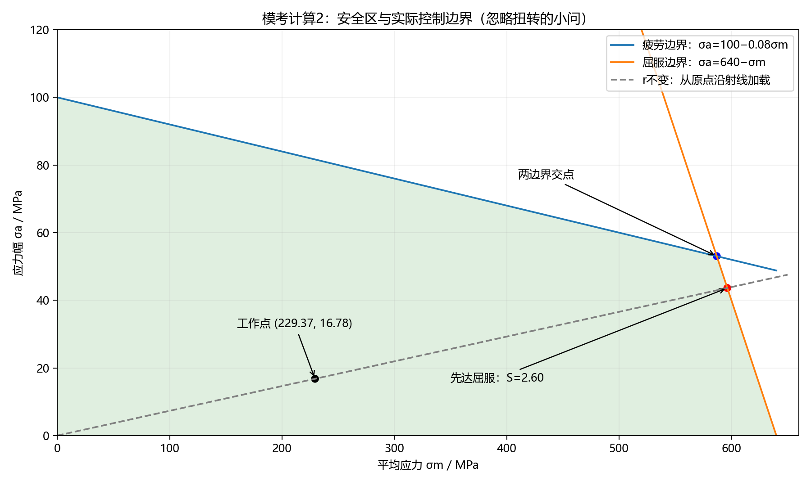
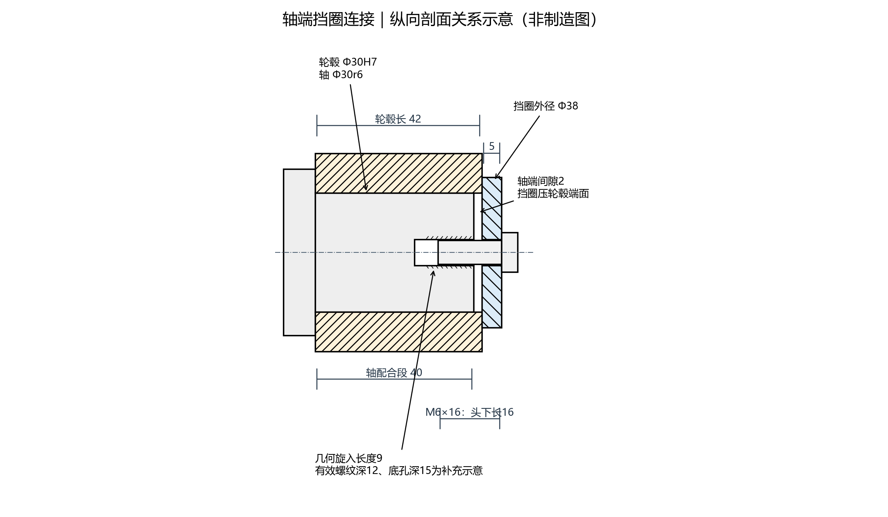
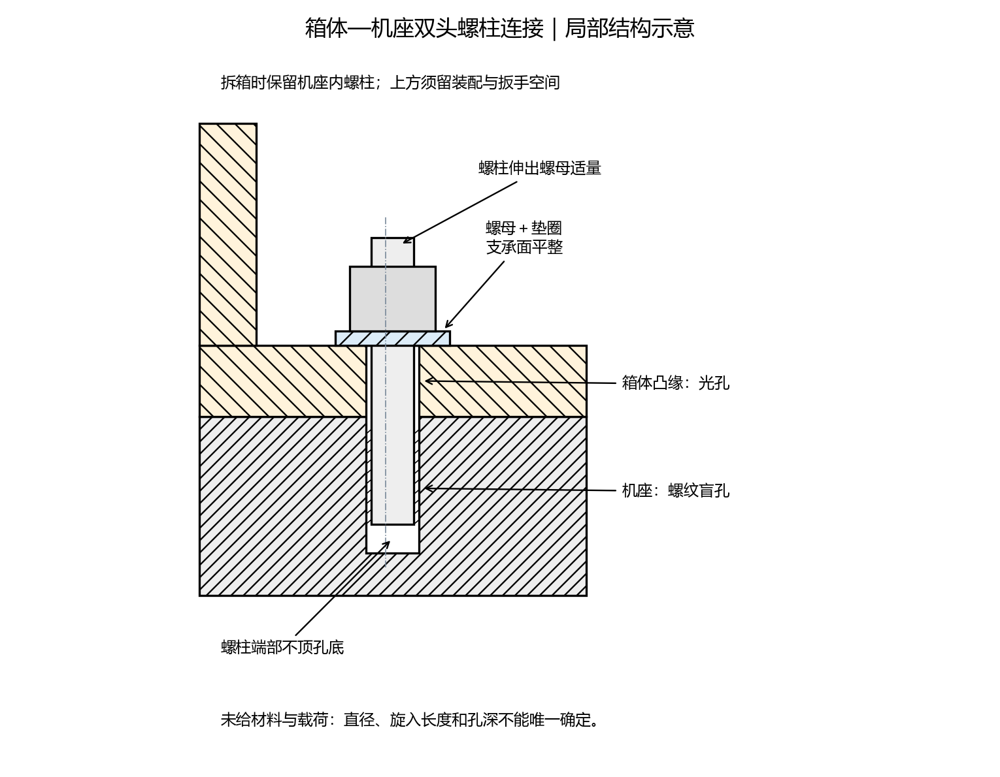

# 四川大学机械855模考卷：答案与详细解析

依据：濮良贵《机械设计》第十版、邱宣怀《机械设计》第四版，以及用户提供的三页模考卷。按用户说明将此卷作为模考卷，不把文件名中的“真题”当作官方来源证明。本解析为独立解答，不是命题方标准答案。

返回 [[00-机械设计知识网络总览]] · 重点复习 [[07-本卷考点与重点复习地图]] · 原卷 [[2027届四川大学机械855考研真题.pdf]]

## 先看结论与题面问题

本卷满分150分。按主考点不重复归类，螺栓连接33分、滚动轴承23.5分、疲劳与强度15.5分、带传动14.5分、轴与结构13.5分，合计100分。具体题号及统计口径见重点地图；这只说明本卷分布。

需要保留的题面说明：

1. **选择19：按原图，四个选项均有受力方向问题。**不能为满足单选格式而指定一个物理上错误的选项，下文逐图说明。
2. **计算1：7310AC的内径代号10对应50 mm，与题给轴颈30 mm矛盾。**本题按明确给定的额定动载荷55.5 kN计算寿命，不擅自换成7306AC；题中漏给的判别系数按濮版表13-5补取 e=0.68。
3. **计算2：形式上的疲劳分支系数约2.846，但实际先到达屈服边界。**按题设 r=常数、忽略扭转的完整极限应力图，控制安全系数为2.60。两种数值的含义必须区分。
4. **计算3：紧、松边拉力按临界打滑状态求解。**若不采用这一条件，仅给初拉力不能唯一确定一般工作状态下的两边拉力。
5. 判断4、7、14、15按教材的通常简化语境解读。其中判断15中的具体倍数不能理解为任意轴承均可直接超速运行；填空7的油温按濮版给出。

## 一、选择题（20题，30分）

### 答案速查

| 题号 | 1 | 2 | 3 | 4 | 5 | 6 | 7 | 8 | 9 | 10 |
|---|---|---|---|---|---|---|---|---|---|---|
| 答案 | C | B | A | B | C | A | A | A | C | D |

| 题号 | 11 | 12 | 13 | 14 | 15 | 16 | 17 | 18 | 19 | 20 |
|---|---|---|---|---|---|---|---|---|---|---|
| 答案 | B | A | C | D | B | D | D | A | 原图无正确项 | B |

### 1. 许用安全系数：C

许用安全系数用于覆盖计算模型与载荷估计的不确定性、材料性能分散及零件重要性等。应力集中、尺寸和表面状态通常还要通过相应系数显式进入零件强度计算，不能全部由一个许用安全系数替代。因此C最准确。

教材：濮版第2—3章；邱版§2.2.4。关联 [[02-疲劳强度与接触强度]]。

### 2. 预紧螺栓应力幅：B

接合面未分离时，螺栓载荷增量为外载增量的相对刚度份额。外载从0变到F，总拉力变动范围为 KcF，而幅值是范围的一半：

$$\sigma_a=\frac{K_cF}{2A_c}$$

预紧力影响平均应力，不能直接把全部预紧力加进应力幅。易错点是漏掉分母2，或把螺栓份额 Kc 写成被连接件份额 1−Kc。

教材：[[《机械设计》濮良贵.pdf#page=108|濮版p.98]]；[[《机械设计》邱宣怀.pdf#page=123|邱版p.108]]。关联 [[05-螺栓连接]]。

### 3. 小带轮最小直径限制：A

带绕轮时产生弯曲应力，近似随带厚增加、随轮径减小而增大。规定小带轮最小基准直径，主要为限制弯曲应力，避免疲劳寿命过低。减小轮径虽能紧凑，却会加重弯曲，不是本限制的目的。

教材：濮版§8-2、§8-3；邱版§11.4.2。关联 [[09-带传动]]。

### 4. V带轮基准直径：B，即图中 db

应取轮槽宽度等于带的基准宽度时所在圆周的直径。按原图尺寸线，db对应此位置；da为外缘直径，df为槽底直径，均不能替代基准直径。不要凭字母d的下标记忆，必须辨认尺寸线所指位置。

教材：濮版§8-1、§8-4；邱版§11.2。关联 [[09-带传动]]。

### 5. 全齿折断常见对象：C

齿宽较小的直齿圆柱齿轮，齿根裂纹容易沿齿宽扩展而形成全齿折断。宽齿轮偏载、斜齿及人字齿轮，可能出现齿的一部分受载较大并发生局部折断。

教材：[[《机械设计》邱宣怀.pdf#page=222|邱版p.207]]；濮版§10-2。关联 [[11-齿轮传动]]。

### 6. 单级动力蜗杆传动比：A

本题备选项中应选8～80。注意这类数值是常用范围，不是绝对边界；濮版第十版p.251写的一般动力传动范围为5～80。8～80属于常用区间，其他选项明显不适合题目所说的通常动力用途。

教材：[[《机械设计》濮良贵.pdf#page=261|濮版p.251]]；邱版第13章。关联 [[12-蜗杆传动]]。

### 7. 滑动速度5～6 m/s的蜗轮材料：A

ZCuSn10P1为铸造锡青铜，减摩、抗胶合性能较好。按濮版的选材条件，这一速度区间宜选锡青铜；铝铁青铜一般用于较低滑动速度，灰铸铁主要用于低速，40Cr通常用于蜗杆而非本题蜗轮。

教材：[[《机械设计》濮良贵.pdf#page=271|濮版p.261]]。邱版的速度分类略有不同，说明应用条件与材料副需要结合考虑，不能混用不同版本的限值。

### 8. 变位与齿形系数：A

在齿数、模数和压力角相同条件下，正变位通常使齿根更厚，抗弯能力提高，齿形系数减小；负变位相反。因此：

$$Y_{F3}>Y_{F1}>Y_{F2}$$

记忆方向：弯曲应力式中齿形系数在分子，其他条件相同时，系数越大越不利。

教材：濮版§10-5、§10-9；邱版§12.7。关联 [[11-齿轮传动]]。

### 9. 塑性安全区的安全系数：C，1.25

题目已指定工作点位于塑性安全区，应按最大应力达到屈服来判断，不能拿对称疲劳极限220 MPa直接除应力幅。

$$\sigma_{\max}=\sigma_m+\sigma_a=300+100=400\ \mathrm{MPa}$$

$$S=\frac{\sigma_s}{\sigma_{\max}}=\frac{500}{400}=1.25$$

这是教材比例加载、r保持不变的相应安全区含义；若另规定平均应力不变等增长方式，需重新按增长路径判断。

教材：[[《机械设计》濮良贵.pdf#page=42|濮版p.32]]；[[《机械设计》邱宣怀.pdf#page=62|邱版p.47]]。

### 10. 摩擦、磨损和润滑的统称：D

三者合起来研究的科学与技术称为摩擦学。摩擦理论、磨损理论或润滑理论只覆盖其中一部分。

教材：濮版第4章；邱版第4章。关联 [[04-摩擦磨损与润滑]]。

### 11. 铰链磨损导致掉链：B，大链轮

铰链磨损使链的有效节距增长，链条在链轮上的啮合位置向齿顶方向移动。按节距圆几何关系，相同节距增量对应的径向外移量为：

$$\Delta r\approx\frac{\Delta p}{2\sin(\pi/z)}$$

齿数越多，分母越小，径向外移越明显，因此仅考虑这一磨损因素时大链轮更容易掉链。别把“较小链轮啮合次数多、受载情况较差”与“磨损伸长后在哪里容易掉链”混成同一个问题。

教材：濮版§9-5；邱版§14.5。关联 [[10-链传动]]。

### 12. 高载荷且轴径受限的选材：A

在给定选项中，40Cr调质钢的强度和综合力学性能较有利于轴的强度设计。题中“调制”应理解为“调质”。这不意味着换高强钢就能解决所有刚度问题；钢的弹性模量差别通常远小于强度差别。

教材：濮版§15-1；邱版§16.1.2。关联 [[03-材料热处理与制造工艺]]、[[13-轴的结构与强度]]。

### 13. 滚动轴承不可缺少的组成：C

滚动体是实现滚动支承的核心。特殊结构可以省去独立内圈或外圈，由轴颈或座孔表面充当滚道；满装等结构也可以没有保持架，但不能没有滚动体而仍称为滚动轴承。

教材：濮版§13-1；邱版§18.1。关联 [[14-滚动轴承]]。

### 14. 增大最小油膜厚度：D

几何关系为：

$$h_{\min}=c(1-\varepsilon)$$

c为半径间隙，ε为偏心率。在给定间隙下，减小偏心率直接增大最小油膜厚度。减少宽径比会损失承载能力；供油已经充分时，继续增加供油量不一定直接增加动压膜厚；缩小间隙会同时改变承载与偏心状态，不能孤立判断。

严谨地说，偏心率是载荷、速度、黏度和几何共同决定的工作状态，不能脱离力平衡任意指定；本题是在给定选项中选最直接的关系。

教材：[[《机械设计》濮良贵.pdf#page=313|濮版p.303]]；邱版§17.9。关联 [[15-滑动轴承]]。

### 15. 花键主要缺点：B

花键承载、对中和导向性能较好，齿根相对浅，对轴的削弱通常较小；主要代价是加工复杂、可能需要专用设备，成本较高。它仍有应力集中，但不是本题对比下最主要的缺点。

教材：[[《机械设计》濮良贵.pdf#page=131|濮版p.121]]。关联 [[07-键花键与销连接]]。

### 16. 带传动滑动率：D，约2.2%

$$\varepsilon=1-\frac{D_2n_2}{D_1n_1}=1-\frac{710\times233}{180\times940}=0.02228\approx2.2\%$$

从动轮实际圆周速度小于主动轮圆周速度；分子、分母反置会得到错误符号或比例。

教材：濮版§8-2；邱版§11.4.3。关联 [[09-带传动]]。

### 17. 点蚀首先出现的位置：D

通常首先在靠近节线的齿根一侧出现。这里接触条件与载荷分配不利，反复接触应力引起疲劳裂纹并逐渐形成剥落。不是最靠近根圆的位置，也不是笼统的“所有齿根处”。

教材：[[《机械设计》邱宣怀.pdf#page=223|邱版p.208]]；濮版§10-2。关联 [[11-齿轮传动]]。

### 18. 能承受较大轴向力的轴向固定：A

在所列方法中，轴端或轴上螺母固定一般可承受较大的轴向力，且可调整和可靠压紧；紧定螺钉、弹性挡圈等通常适合较小轴向载荷或辅助定位。实际还应校核螺纹、接触面和相关截面。

教材：濮版§15-2；邱版§16.2。关联 [[13-轴的结构与强度]]。

### 19. 蜗杆受力方向：原图无完全正确选项

用三条规则判别：径向力指向所研究构件轴心；主动蜗杆的圆周力与接触点圆周速度相反；蜗杆轴向力与蜗轮圆周力大小相等、方向相反。

| 图 | 原图的问题 |
|---|---|
| A，第1图 | 径向力向下是对的。但蜗轮按图顺时针转，底部接触点速度向左，从动蜗轮所受驱动圆周力应向左，故蜗杆所受轴向反力应向右；原图却画向左。 |
| B，第2图 | 蜗杆在蜗轮下方，作用于蜗杆的径向力应向下指向蜗杆轴心，图中向上。 |
| C，第3图 | 蜗杆端视转向为顺时针，其顶部接触点圆周速度向右；主动件圆周阻力应向左，图中却向右。 |
| D，第4图 | 蜗杆顶部接触点的径向力应向下，图中向上；其圆周力也没有正确体现对主动件运动的阻碍。 |

因此，按收到的这一版图，不能给出A～D中无矛盾的答案。若命题方预期选A，至少需要纠正A的轴向力或相关转向标注。建议在自我评分时将该题单独标为“题面待更正”，不要把错误箭头背成规则。

教材：[[《机械设计》濮良贵.pdf#page=272|濮版p.262受力规则]]。关联 [[12-蜗杆传动]]。

### 20. 凸台或沉头座：B

它们用于使螺栓头或螺母的支承面平整，并与螺栓轴线垂直，从而减少偏斜引起的附加弯曲应力。降低应力幅、减轻螺纹根部应力集中、均匀各圈螺纹受力分别对应其他措施。

教材：濮版§5-8；邱版§6.5.2。关联 [[05-螺栓连接]]。

## 二、判断题（16题，24分）

### 答案速查

| 题号 | 1 | 2 | 3 | 4 | 5 | 6 | 7 | 8 |
|---|---|---|---|---|---|---|---|---|
| 答案 | × | × | × | √* | √ | √ | √* | × |

| 题号 | 9 | 10 | 11 | 12 | 13 | 14 | 15 | 16 |
|---|---|---|---|---|---|---|---|---|
| 答案 | √ | × | × | × | × | √* | √* | √ |

带*者须连同下述条件理解；不是脱离工况的绝对结论。

### 1. 最基本设计准则是刚度准则：×

在教材的通常表述中，强度准则是机械零件设计中最基本、最常用的准则。刚度很重要，但不能用来替代所有零件的强度或其他工作能力准则。依据：濮版§2-6；邱版§2.2。

### 2. 小型机器都先小批量生产再定型鉴定：×

不能把这一流程作为所有小型机器的固定程序。设计验证一般包括样机试制、试验及评价，之后按产品性质安排生产设计和小批试制等；“小批试制”也不等同于直接投入小批量生产。题目的“都是”及先后关系过于绝对。邱版p.3流程明确包含样机试制、样机试验和技术经济评价。依据：[[《机械设计》邱宣怀.pdf#page=18|邱版p.3]]。

### 3. 变应力都由变载荷产生：×

恒定空间方向的横向力作用于旋转轴时，轴表面一个材料点随转动交替处于拉、压区，仍产生交变弯曲应力。应跟踪材料点，不能只看外力数值是否变化。依据：濮版第3章、§15-1；邱版§2.1。

### 4. 动压润滑、载荷不变时速度增大使最小膜厚增大：√，有条件

在黏度、几何、供油等其他条件相同、维持稳定液体动压润滑的通常模型下，相对速度增大使动压承载能力增强，平衡位置对应的偏心率减小，最小膜厚增大。若速度增大同时造成明显温升、黏度下降或失稳，不能直接外推。依据：濮版§12-7；邱版§17.9。

### 5. 翻转力矩下螺栓尽量远离接合面形心：√

在保证结构及受压接触条件合理的前提下，将螺栓布置得远离力矩作用对应的中性轴，可增大抗倾覆力臂，减小所需螺栓力。精确表达应看相对于翻转轴的距离，而非任何方向的径向距离都等效。依据：濮版§5-5；邱版§6.4.4。

### 6. 表面越粗糙，疲劳强度越低：√

其他条件完全相同时，表面微观缺口更严重，更容易形成疲劳裂纹源，表面质量修正更不利。依据：濮版§3-2；邱版§3.3.3。

### 7. 普通平键定心精度低于花键：√，按常用结构对比

教材把花键的对中性、导向性和可磨削提高精度列为优点。本题按常用连接的总体性能比较判对。但平键连接的径向定心主要依靠轴与轮毂孔的配合，不能说任何制造精度的平键连接必然差于任何花键。依据：[[《机械设计》濮良贵.pdf#page=131|濮版p.121]]。

### 8. 避免过渡链节主要因为装配困难：×

主要因为过渡链节链板受力偏心，有附加弯曲，应力条件较差、承载能力降低。通常优先选偶数链节以避免使用。依据：濮版§9-2；邱版§14.2。

### 9. 轴瓦油沟在非油膜承载区：√

应避免在主要承载油膜区域开沟，破坏压力建立与承载连续性；油沟用于将润滑剂合理引到需要的位置。依据：濮版§12-4；邱版§17.4。

### 10. 当量动载荷禁止超过额定动载荷：×

额定动载荷C对应规定基本额定寿命的承载参数，不是任意条件下的绝对最大力。若P>C，基本寿命模型给出不足100万转的寿命；是否可用还需检查要求寿命、静强度及其他限制。依据：濮版§13-5；邱版§18.5。

### 11. 不可拆连接一定比可拆连接可靠：×

可拆性与可靠性不是同一指标。焊接、胶接、铆接、螺栓等各有材料、载荷、工艺、缺陷和维护条件，不能仅凭是否可拆进行普遍排序。依据：两书连接篇及可靠性部分。

### 12. 螺栓组统一材料和尺寸主要为了计算方便：×

主要为了制造、采购、装配和维修方便，减少规格并避免错装；通常按最危险螺栓确定统一规格。计算简化只是附带效果。依据：濮版§5-5；邱版§6.4。

### 13. 蜗杆和蜗轮都像齿轮一样变位加工：×

普通圆柱蜗杆传动的常用变位方式保持标准蜗杆几何，主要对蜗轮进行变位；不能将圆柱齿轮副的两轮变位方法原样套用。此结论针对教材所述普通蜗杆体系。依据：濮版§11-2的几何计算；邱版§13.3—13.4。

### 14. 喷丸等通过表层强化和残余压应力提高疲劳性能：√，按命题意图

题中“疲劳程度”应为“疲劳强度”。喷丸通过表层塑性变形、加工硬化和残余压应力改善疲劳性能；渗碳及适当高频淬火可提高表层性能，并形成有利的残余应力状态。不同工艺机制不完全相同，处理质量及参数也重要。依据：濮版§3-2；邱版§3.3。

### 15. 改善润滑冷却后可超过手册极限转速：√，按通常命题意图；倍数不宜绝对化

手册极限转速是在规定润滑、载荷和结构条件下确定的；改善润滑冷却、精度、保持架等，可提高允许转速。两本书支持“原手册值可在改变条件后提高”。但题面“高于极限速度1～2倍”表达含混，也不是对任意轴承的保证倍数，应单独注记。

依据：[[《机械设计》邱宣怀.pdf#page=398|邱版p.383]]；[[《机械设计》濮良贵.pdf#page=357|濮版p.347]]。如果按严格的无条件定量断言判题，则此题缺少条件，需命题方明确评分口径。

### 16. 一般尽量避免三支点轴系：√

三支点轴系易形成超静定支承，对同轴度、制造和装配精度较敏感，偏差可能引入附加载荷。因此一般避免不必要的三支点，并非工程上绝对不能使用。依据：濮版§15-2；邱版第16章。

## 三、填空题（23分）

### 1. 润滑油与润滑脂指标（2分）

答：**黏度；锥入度（或针入度、稠度）。**

黏度反映油的内摩擦和流动特性；锥入度反映脂的稠度。润滑脂的滴点也是重要指标，主要与温度适用性有关，但题中单空强调稠度指标时优先填锥入度。

教材：[[《机械设计》濮良贵.pdf#page=73|濮版p.63]]；邱版§4.7—4.9。

### 2. 螺栓拧紧力矩组成（2分）

答：**螺纹副阻力矩；螺母或螺栓头支承面上的摩擦阻力矩。**

$$T=T_1+T_2$$

螺纹副力矩包含沿螺旋面提升载荷和摩擦的作用，不应只把拧紧力矩当成螺杆传递的纯工作扭矩。

教材：[[《机械设计》濮良贵.pdf#page=88|濮版p.78]]。

### 3. 销的类型与主要功能（4分）

答：**圆柱销；圆锥销；定位；连接。**

特定销还可用作过载保护的安全销，但本题两个主要功能空通常填定位、连接。不要把键的主要传矩功能直接移到所有销上。

教材：濮版§6-4；邱版§7.3。

### 4. V带梯形截面与基准带长（2分）

答：**利用楔形增力作用，增大有效摩擦传力能力；基准宽度（节宽/节线）处。**

V带主要靠两个侧面与轮槽接触传力，底部不应压在槽底。基准带长对应带在带轮上、规定张紧条件下，基准宽度处的圆周长度，不是任意测得的外周长或内周长。

教材：濮版§8-1；邱版§11.2。

### 5. 标准模数所处平面（3分）

答：**端面（直齿时与法面重合）；法面；大端端面。**

分别对应直齿圆柱齿轮、斜齿圆柱齿轮、直齿锥齿轮。斜齿的端面模数与法面模数不同；锥齿轮沿齿宽的尺寸变化，以大端参数作为标准基准。

教材：濮版§10-5、§10-7、§10-8；邱版§12.5、§12.8、§12.9。

### 6. 齿轮载荷增加1倍（2分）

答：**2；√2（约1.414）。**

“增加1倍”即变为原来的2倍。其他几何和系数不变时，齿根弯曲应力与载荷成正比，接触应力与载荷平方根成正比：

$$\sigma_F\propto F,\qquad\sigma_H\propto\sqrt{F}$$

教材：濮版§10-5；邱版§12.7。

### 7. 蜗杆热平衡目的与油温（2分）

答：**使发热与散热平衡，将润滑油温控制在允许范围，防止油黏度过低和胶合等工作失效；一般60～70 ℃，最高不超过80 ℃。**

该温度数值按用户提供的濮良贵第十版p.275。它是此教材的常规设计取值，不是对所有润滑油、冷却方式和特殊蜗杆装置统一适用的上限。

教材：[[《机械设计》濮良贵.pdf#page=285|濮版p.275]]；邱版§13.8。

### 8. 一维雷诺方程与黏度（2分）

答：

$$\frac{dp}{dx}=\frac{6\eta v(h-h_0)}{h^3}$$

η为润滑油的**动力黏度**，SI单位Pa·s；h0是压力达到最大值处的膜厚，不是最小膜厚hmin。x沿运动方向取正，v为一个表面相对另一个表面的速度。

在定常、等黏度、不可压缩、层流、无侧泄漏等假设下，也可写成：

$$\frac{d}{dx}\left(h^3\frac{dp}{dx}\right)=6\eta v\frac{dh}{dx}$$

不能将运动黏度ν直接代入η的位置；两者满足η=ρν。

教材：[[《机械设计》濮良贵.pdf#page=309|濮版p.299，式12-8]]；邱版§17.8。

### 9. 联轴器与离合器（4分）

相同：**都用于连接两轴（或轴与回转零件），传递运动和转矩。**

区别：**联轴器在工作过程中通常保持联接，要分离一般需停机并拆卸；离合器可以按需要在运行过程中控制接合或分离，具体接合条件取决于离合器类型。**

注意：这不表示任何离合器都能在任意转速差、任意载荷下接合。

教材：濮版第14章；邱版§19.1。

## 四、简答题（13分）

### 1. 高速电机、径向力及一定双向轴向力，且有温升（4分）

**推荐答法：选用深沟球轴承作为基本方案，并采用能容许主轴热伸长的支承配置。**

1. 深沟球轴承适合较高转速，摩擦损失较小，适合连续运行电机。
2. 主要承受径向载荷，同时能承受一定双向轴向载荷，符合题目给出的定性工况。
3. 采用一个定位端、一个游动端等合理配置，使主轴受热后能轴向伸长，避免过度约束造成附加轴向力或游隙过小。
4. 根据温升合理选配合、工作游隙、润滑与密封，并核对寿命和转速条件。

**替代方案的边界：**若轴向载荷或轴向刚度要求较高，可选成对角接触球轴承承担双向轴向载荷，但单只角接触球轴承不能独立承担任意双向轴向载荷；还需安排热伸长补偿。题目没有定量载荷，不能唯一锁定具体型号。

本题拿分重点是“类型的能力＋双向轴向力＋热伸长”。只答“角接触球轴承”而不说明成对配置不完整。

教材：濮版§13-3、§13-6；邱版§18.2、§18.9。

### 2. 振动工况螺纹为何松动，怎样分类防松（5分）

**原因：**普通连接螺纹通常满足静态自锁条件，但自锁不能保证振动中不松动。振动、冲击或横向交变载荷可使接触面产生相对微滑移，摩擦约束减弱，发生相对回转，预紧力逐步丧失。接触面嵌入、材料松弛和温度变化也可能使夹紧力下降。

按濮版分类答三类，并各举例：

- **摩擦防松：**对顶螺母、自锁螺母等，通过增加或保持螺纹副摩擦阻力限制相对回转。
- **机械防松：**开槽螺母与开口销、止动垫片、串联金属丝等，利用机械约束阻止回转。
- **破坏螺纹副运动关系的防松：**冲点、焊接、胶粘等，使螺纹副难以相对转动，常影响拆卸。

答题必须分开“静态自锁”和“振动防松”；不应仅写成“振动使螺纹升角改变”。题目借飞行器提供工况背景，本解答是教材分类题，不据此指定真实飞行器紧固方案。

教材：[[《机械设计》濮良贵.pdf#page=89|濮版p.79及表5-3]]；邱版§6.2。

### 3. 设计机器的基本要求（4分）

按濮版§2-3，可组织为四方面：

1. **使用功能：**实现预定运动、动力和工作任务，工作性能满足要求。
2. **经济性：**兼顾设计制造与使用维护成本，合理标准化、提高效率，便于加工装配和维修。
3. **劳动保护和环境保护：**安全、操作方便，控制噪声、泄漏与污染等。
4. **寿命和可靠性：**在规定工况和寿命内可靠完成工作。

强度、刚度、耐磨性等是落实这些要求时的零件工作能力准则，不宜只罗列几个强度公式来回答整机要求。

教材：[[《机械设计》濮良贵.pdf#page=21|濮版p.11—12]]；邱版§1.2.1。

## 五、分析题（12分）

### 1. 各轴分类（4分）

| 轴 | 分类 | 判断理由 |
|---|---|---|
| Ⅰ | 传动轴 | 位于动力机与联接装置之间，按图的主要功能传递转矩，不承担传动件带来的显著工作弯矩。 |
| Ⅱ | 转轴 | 小齿轮受啮合力造成弯曲，同时由输入端向齿轮传递转矩。 |
| Ⅲ | 转轴 | 支承传动齿轮，承受啮合力产生的弯矩，并在两级齿轮之间传递转矩。 |
| Ⅳ | 心轴 | 卷筒与大齿轮用螺栓直接固连，驱动转矩由齿轮经连接直接进入卷筒；该轴主要支承回转组件并承受弯矩。 |

关键是沿动力路线判断“转矩是否经过轴截面”。零件在转动，不等于支承它的轴一定承担工作转矩。原简图未充分标明Ⅳ轴与支座、回转组件之间的固定关系，不能据此唯一细分固定心轴或转动心轴；本小问可靠的结论是“心轴”。

教材：濮版§15-1；邱版§16.1。关联 [[13-轴的结构与强度]]。

### 2. 以Ⅱ轴说明疲劳因素与改进措施（8分）

Ⅱ轴在传矩同时受齿轮作用力。随轴转动的材料点承受交变弯曲应力；转矩的循环性质需根据驱动工况另行判断。

| 影响因素 | 在Ⅱ轴上怎样体现 | 对应改善措施 |
|---|---|---|
| 应力集中 | 齿轮轴肩、键槽、退刀槽、直径突变 | 增大合理过渡圆角、平缓过渡，改进键槽端部形状，避免尖锐缺口；同时防止装配干涉。 |
| 尺寸与危险截面 | 相同材料下真实尺寸影响疲劳极限，较小截面应力较高 | 按危险截面合理确定直径，避免只看最大弯矩位置，也不能只凭加粗就忽略尺寸修正。 |
| 表面状态 | 刀痕、粗糙表面和缺陷易成为裂纹源 | 降低危险部位粗糙度，避免表面划伤和加工缺陷。 |
| 材料及表面强化 | 材料疲劳性能、热处理和残余应力 | 选适当材料与热处理，合理采用喷丸、滚压或表面淬火等强化。 |
| 载荷与结构布局 | 齿轮受力、支承跨距、冲击、偏载 | 改善支承和载荷布置，减少悬臂与不必要跨距，降低冲击和振动，保证对中和装配。 |

作答时先写“影响因素”，再一一对应“措施”。不要只答“换强度更高的钢”，也不要把材料强度提高等同于弹性模量提高。

教材：濮版§3-2、§15-2—15-3；邱版§3.3、§16.6。关联 [[02-疲劳强度与接触强度]]。

## 六、计算题（38分）

### 1. 两只角接触球轴承寿命（按本大题总分推得本题15分）

#### 模型与数据说明

按图正装：左轴承Ⅰ的派生力S1向右，右轴承Ⅱ的派生力S2向左，外轴向力Fa=900 N向左。沿用原图轴承编号，不能因另一教材图号习惯而交换左右。

采用C=55.5 kN=55500 N、n=2000 r/min、冲击系数fp=1.5；按25°角接触球轴承补取e=0.68。忽略题目未要求的温度及额外可靠度修正。本题结果为基本额定小时寿命，不是某一只轴承保证实际工作到该时刻。

7310AC与轴颈30 mm存在尺寸矛盾，本解只完成题给C值下的寿命演算；不能宣称该型号可直接装在30 mm轴颈上。

#### 第一步：求派生轴向力

$$S_1=0.68R_1=0.68\times3200=2176\ \mathrm N$$

$$S_2=0.68R_2=0.68\times1000=680\ \mathrm N$$

比较：S1=2176 N，大于S2+Fa=1580 N。因此若仅按两侧各自派生力，轴有向右移动趋势，轴承Ⅱ被压紧，轴承Ⅰ相对放松。

#### 第二步：实际轴向载荷

放松侧按其自身派生力计，压紧侧按轴向平衡求：

$$A_1=S_1=2176\ \mathrm N$$

$$A_2=S_1-F_a=2176-900=1276\ \mathrm N$$

检查：A1−A2−Fa=0，且A1≥S1、A2≥S2，满足该模型。此时不能误写A1=Fa+S2=1580 N，因为这小于轴承Ⅰ自身派生力2176 N，不符合压紧、放松判别。

#### 第三步：选X、Y并算当量动载荷

轴承Ⅰ：

$$\frac{A_1}{R_1}=\frac{2176}{3200}=0.68=e$$

等号属于题给的“≤e”一栏，X1=1，Y1=0：

$$P_1=1.5(1\times3200+0\times2176)=4800\ \mathrm N$$

轴承Ⅱ：

$$\frac{A_2}{R_2}=\frac{1276}{1000}=1.276>e$$

取X2=0.41、Y2=0.87：

$$P_2=1.5(0.41\times1000+0.87\times1276)=2280.18\ \mathrm N$$

#### 第四步：分别求寿命，取控制者

角接触球轴承寿命指数为3：

$$L_{10h}=\frac{10^6}{60n}\left(\frac CP\right)^3$$

$$L_{10h,1}=\frac{10^6}{60\times2000}\left(\frac{55500}{4800}\right)^3\approx12882\ \mathrm h$$

$$L_{10h,2}=\frac{10^6}{60\times2000}\left(\frac{55500}{2280.18}\right)^3\approx120168\ \mathrm h$$

**答：按通常教材支承设计取较短者，控制轴承为Ⅰ，工作寿命约1.29×10⁴ h。**这不是按串联系统可靠度重新定义的整套轴承系统90%寿命，题目未要求后者。

易错点：漏掉派生力；外轴向力直接平分；等号选错栏；55.5 kN不换单位；fp重复计入；球轴承误用滚子指数10/3。

教材：[[《机械设计》濮良贵.pdf#page=341|濮版p.331，表13-5]]、[[《机械设计》濮良贵.pdf#page=342|p.332派生力]]、[[《机械设计》濮良贵.pdf#page=343|p.333正装受力]]及p.330寿命式。关联 [[14-滚动轴承]]。

### 2. 同时承受横向载荷和轴向变载荷的紧螺栓（15分）

#### 统一记号

F0：安装预紧力；F″：最大轴向工作载荷时仍保留的残余预紧力；F2：最大总拉力；χ=Cb/(Cb+Cm)=0.3。接合面始终不分离，忽略额外撬力等题目未给效应。

#### （1）抗滑条件、残余预紧力与最大总拉力（6分）

普通螺栓连接的横向力靠接合面摩擦传递，应以工作中最小夹紧力验算，不能只用尚未加载时的安装预紧力：

$$mfF''\ge K_sF_R$$

$$F''\ge\frac{1.2\times150}{1\times0.15}=1200\ \mathrm N$$

取满足题设防滑要求的最小值F″=1200 N。在最大轴向工作载荷1000 N下：

$$F_2=F''+F_{\max}=1200+1000=2200\ \mathrm N$$

安装预紧力作为后续疲劳计算的中间量：

$$F_0=F''+(1-\chi)F_{\max}=1200+0.7\times1000=1900\ \mathrm N$$

自检：F2=F0+χFmax=1900+300=2200 N；残余夹紧力从1900 N降至1200 N，始终为正，符合前述模型。题目虽称汽缸盖，但未给额外密封压力条件，因此这里只按明确要求的防滑条件定最小预紧，不能擅加密封倍率。

#### （2）静强度要求的小径（6分）

$$[\sigma]=\frac{\sigma_s}{S_s}=\frac{640}{2.0}=320\ \mathrm{MPa}$$

紧螺栓静强度按教材用1.3计入拧紧引起的拉扭综合作用：

$$\frac{1.3F_2}{\pi d_1^2/4}\le[\sigma]$$

$$d_1\ge\sqrt{\frac{4\times1.3\times2200}{\pi\times320}}=3.373\ \mathrm{mm}$$

**答：理论最小螺纹小径约3.37 mm。**这是小径，不是公称直径，不可直接写“M3.37”。题目未要求选标准规格，后续取未圆整理论小径进行连续数值计算；实际选型应采用小径满足要求的标准螺纹并重新校核。

#### （3）r为常数时的疲劳分支与控制安全系数（3分）

注释只要求在本疲劳步骤忽略扭转，不应倒推删去第（2）问的1.3。

采用理论最小小径，对应面积：

$$A_c=\frac{1.3F_2}{[\sigma]}=8.9375\ \mathrm{mm^2}$$

螺栓实际总拉力在1900～2200 N间波动，所以：

$$F_{ba}=\frac{2200-1900}{2}=150\ \mathrm N$$

$$F_{bm}=\frac{2200+1900}{2}=2050\ \mathrm N$$

$$\sigma_a=\frac{150}{8.9375}=16.783\ \mathrm{MPa}$$

$$\sigma_m=\frac{2050}{8.9375}=229.371\ \mathrm{MPa}$$

$$r=\frac{1900}{2200}=0.86364$$

按题给KσD=2.5、ψσ=0.2写疲劳分支的形式系数：

$$S_f=\frac{\sigma_{-1}}{K_{\sigma D}\sigma_a+\psi_\sigma\sigma_m}=\frac{250}{2.5\times16.783+0.2\times229.371}=2.846$$

**但不能到此就宣布实际安全系数为2.846。**在r保持不变的增长路径上，还要比较屈服边界：

$$S_y=\frac{\sigma_s}{\sigma_m+\sigma_a}=\frac{640}{229.371+16.783}=2.60$$

先到屈服边界，因此按完整极限应力图，工作点属于塑性控制区：

$$S_{ca}=\min(S_f,S_y)=2.60$$

**评分口径建议：同时写出“疲劳直线外推系数2.846，受屈服截断后的控制安全系数2.60”。**如果命题方把“疲劳安全系数”仅用于指疲劳分支公式，其预期数值可能为2.85；但依据两书的安全区判断，实际不能忽略先发生屈服。第（2）问含拧紧扭转的静安全系数为2.0，与本步骤忽略扭转后的2.60不矛盾。

若改用实际圆整规格，面积改变，上述应力和系数应重算。螺栓在自然外载增大、预紧不变时常见最小应力不变路径；本小问既明确假设r=常数，就必须遵守该假设，不能偷偷换路径。

教材：濮版§5-6、§3-2；特别是[[《机械设计》濮良贵.pdf#page=42|濮版p.32的疲劳区/塑性区两种公式]]、[[《机械设计》邱宣怀.pdf#page=62|邱版p.47的安全区说明]]。关联 [[05-螺栓连接]]、[[02-疲劳强度与接触强度]]。

### 3. 单根V带最大传力与功率（8分）

#### 模型说明

结合第（2）问的“最大”，第（1）问按临界打滑状态求紧、松边拉力。采用教材基本模型，忽略离心拉力对初拉力关系的修正，取F1+F2=2F0。题目未给线密度，无法另做离心修正。

#### （1）紧边、松边拉力（4分）

包角必须换成弧度：

$$\alpha_1=150^\circ=\frac{5\pi}{6}=2.61799\ \mathrm{rad}$$

$$q=e^{f'\alpha_1}=e^{0.52\times2.61799}=3.90148$$

极限摩擦关系及初拉力关系为：

$$\frac{F_1}{F_2}=q,\qquad F_1+F_2=2F_0=824\ \mathrm N$$

$$F_1=\frac{824q}{q+1}=655.89\ \mathrm N$$

$$F_2=\frac{824}{q+1}=168.11\ \mathrm N$$

这里题给0.52已是当量摩擦因数，不能再重复乘入V槽楔形增力的修正。

#### （2）最大有效圆周力和功率（4分）

$$F_{\max}=F_1-F_2=487.78\ \mathrm N$$

$$v=\frac{\pi d_{d1}n_1}{60000}=\frac{\pi\times140\times1440}{60000}=10.5558\ \mathrm{m/s}$$

$$P_{\max}=\frac{F_{\max}v}{1000}=5.1488\ \mathrm{kW}$$

**答：F1≈655.9 N，F2≈168.1 N，Fmax≈487.8 N，Pmax≈5.15 kW。**这是按摩擦极限得到的单根带传力上限，不代表完成疲劳、带型、轮径和使用条件校核后的最终额定功率。

易错点：包角150直接放入指数；紧松边相加当有效力；把轮径140 mm当成140 m；将当量摩擦因数再次修正；认为欧拉等式对所有负载都成立。

教材：[[《机械设计》濮良贵.pdf#page=169|濮版p.159，式8-5—8-7]]；邱版§11.4。关联 [[09-带传动]]。

## 七、轴系结构与螺纹连接作图（10分）

以下图为依据题给尺寸绘制的教学结构示意，未给出的外廓尺寸仅作示意；不是完整制造图。

### 1. M6×16轴端挡圈连接（5分）

**结构：轮毂左端抵住轴肩，右端用轴端挡圈压紧，M6×16六角头螺栓穿过挡圈中心光孔，旋入轴端轴向M6螺纹盲孔。**

必须画清楚的关系：

1. 轴的配合段长40 mm，轮毂长42 mm，轮毂抵住左轴肩后，其右端超出轴端2 mm。
2. 挡圈接触并压住轮毂右端，挡圈与轴端之间留2 mm间隙。若让挡圈先顶住轴端，就不能压紧轮毂。
3. 挡圈外径38 mm大于轴径30 mm，形成环状压紧区域；厚度为5 mm。挡圈中心是供M6螺栓通过的光孔，不是再攻一个M6螺纹孔。
4. 螺栓长度16 mm从头下承压面算起。若本图不另加垫圈，进入轴内的几何长度为16−5−2=9 mm。
5. 轴端有效螺纹深度和底孔深度应留余量，螺栓端部不能顶到孔底。图中示意采用有效螺纹深度12 mm、底孔总深度15 mm；这是为展示余量的补充设计，不是题目给定尺寸。最终应按材料、载荷及加工规范确认。

图上应保留Φ30r6/Φ30H7配合含义，螺栓沿轴线放置；纵向剖到的轴和螺栓按装配图惯例不画剖面线，轮毂和挡圈应可清楚区分。

教材：濮版§5-2、§15-2；邱版§6.1、§16.2。关联 [[13-轴的结构与强度]]、[[05-螺栓连接]]。

### 2. 箱体与机座连接（5分）

**推荐采用双头螺柱连接：下端旋入机座螺纹盲孔，上端穿过箱体凸缘光孔，以垫圈和螺母压紧。**

从原图可见，机座较厚，下面不便安装螺母，上方还有箱体壁面遮挡。双头螺柱可以先装入机座，再装箱体，最后在凹腔内拧紧螺母；拆箱时保留机座内的螺柱，避免反复拆装机座螺纹。

图中要表达：

1. 机座为螺纹盲孔，箱体凸缘为光孔，不能把两个被连接件都画成同一根螺柱的连续螺纹孔。
2. 螺母及垫圈压在平整、与螺柱轴线垂直的支承面上；必要时加工凸台或沉头座。
3. 螺柱旋入端不顶孔底，拧紧端伸出螺母适量，留出扳手操作空间。
4. 旋入深度与被连接件材料有关。题目未给材料和尺寸，所以不能唯一确定螺柱直径、旋入深度或孔深；图中按结构关系示意。

若另有“不经常拆卸且螺钉装入与工具空间充足”的条件，螺钉连接也可能成立；本题图示约束下，双头螺柱是更合适的推荐答法。

教材：[[《机械设计》濮良贵.pdf#page=84|濮版p.74，图5-3及连接特点]]；邱版§6.1。关联 [[05-螺栓连接]]。

## 本卷复习时必须记牢的十句话

1. 螺栓横向抗滑用工作中最小残余夹紧力，不只用安装预紧力。
2. 螺栓应力幅是总拉力变化范围除以2A，不是外载最大值直接除A。
3. 疲劳安全系数要先选增长路径，再看先碰疲劳线还是屈服线。
4. 角接触轴承先判断压紧、放松，再求实际轴向载荷。
5. 额定动载荷C是寿命参数，不是绝对最大允许力。
6. V带的欧拉关系取等号对应临界打滑，包角用弧度。
7. 齿轮载荷翻倍，弯曲应力翻倍，接触应力变为√2倍。
8. 主动件圆周力阻碍本构件转动，从动件圆周力驱动本构件转动。
9. 雷诺方程中的h0不是最小膜厚，η是动力黏度。
10. 作结构图先画载荷与压紧路径，再检查间隙、盲孔底和装配通路。

以上解析覆盖本卷全部54道编号题及其小问。建议先独立作答，再查答案，并将错因写入对应专题卡。
