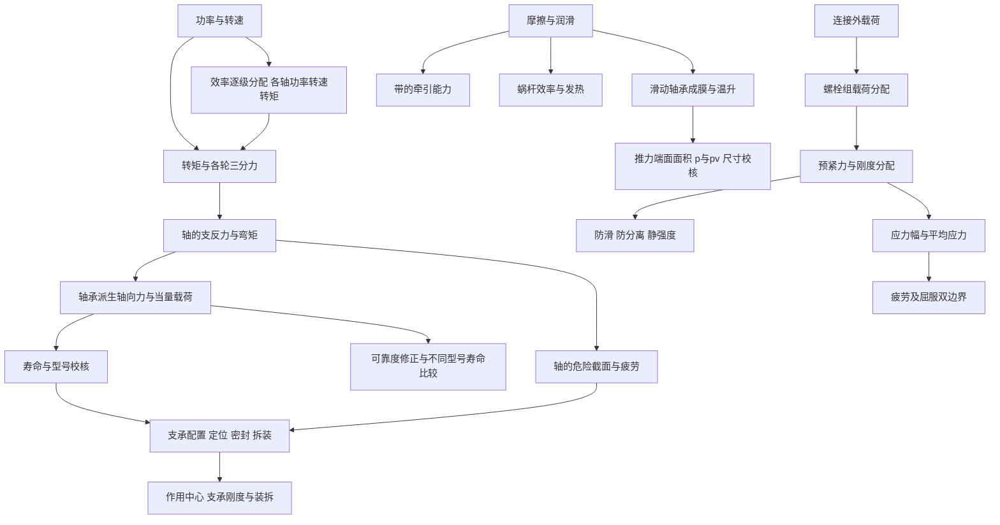

# 川大855：以真题为边界的精简知识网络

**优先练熟：螺栓连接、滚动轴承、推力滑动轴承、传动受力与功率分配、轴系结构；疲劳强度是贯穿计算的基础。**齿轮、带、蜗杆继续按参数和原理小题精学；链、键销、材料及联轴器选用用短清单复习。

**2026-09-09更新：**新增资料已去重，正式补入可靠度寿命、推力轴承尺寸/校核、整机效率与转矩、正反装支承刚度。先看 [[05-新增年份考点与必练模型]]，再按本页12张卡复习。

这份笔记用来替代按教材逐章平均用力的复习方式。两本教材作为查原理的工具，旧版20专题保留作资料库；本页的“保留范围”才是本轮学习清单。

资料合并覆盖**2000—2018、2021—2023，共22个不同年份**；仍缺2019、2020，2024年以后未提供。2022、2023含回忆版，部分题量/分值或数据不全，不能当作22套完整卷。去重及页码见 [[04-新增资料去重与年份覆盖]]，大题证据见 [[01-历年真题证据索引]]。**重点是样本支持的学习优先级，不代表当前官方大纲或必考承诺。**

入口：[[05-新增年份考点与必练模型]] · [[06-附带解析纠错与使用边界]] · [[02-进阶变式与预测边界]] · [[03-两周模型训练与验收]] · [[川大855真题精简网络.canvas]] · [[07-本卷考点与重点复习地图]] · [[四川大学855模考卷-答案与详细解析]]。

## 一、先确定学习投入

|层级|学习对象|学到什么程度|依据|
|---|---|---|---|
|A 核心计算|螺栓；滚动轴承；推力滑动轴承|独立建模、选式、反求和校核；轴承包含可靠度与不同类型比较|2021综合1、2、5；2022综合1—3；2015、2017推力轴承|
|A 核心图题/系统计算|传动旋向受力、逐级P/n/T；轴系结构|陌生布局推导，改错重画，解释每处功能后果|2014—2018、2021—2023可见题；2017/2023输送机|
|A 基础模型|疲劳与静强度、强度/刚度|循环参数、极限图、加载路径、有限寿命；支承刚度比较|2015分级寿命，2016极限图，2018安全性；2012支承刚度|
|B 原理与参数|齿轮强度比较、带、蜗杆、动压润滑|解释因果，画图，做参数与效率计算|新增年份持续出现，具体题号见新增证据表|
|C 精确记忆|链、键销、材料/代号、螺纹几何、联轴器选用|按已考规则及其条件记忆，不背标准表全集|2017、2021—2023小题及简答|

A不意味着只学A；B、C的小题失分会显著影响总分。**避免把“某章出现过”扩大成“整章都要精读”。**

## 二、用三条链连接知识

箭头表示解题依赖。轴承题给出支反力时可以从中间进入；不能因为原题给了结果，就省掉自己对上游受力模型的理解。

## 三、12张精简知识卡

### 1. 螺栓连接：最高优先级

**已考证据：**2021五1；2022五3；2023五1（回忆）；2016五5；2014五2；2013五2；2011五1；2010四2；2005六1；2004六1；2001四。各年PDF页码见索引。

**保留六件事：**

1. 类型与传力：普通螺栓、铰制孔螺栓、双头螺柱、螺钉；厚件/盲孔/经常拆卸如何选。
2. 普通横向连接靠接合面摩擦传力，螺栓主要承受预紧拉力；铰制孔连接按剪切和挤压校核。外力方向与螺栓受力方向不是一回事。
3. 拧紧时拉伸与扭转的复合影响，通常用1.3系数折算；螺纹小径、名义直径不能混用。
4. 轴向连接的预紧力、残余预紧力、总拉力和相对刚度；工作载荷变动后应力幅如何变化。
5. 螺栓组：直接载荷、平面内偏心力矩、倾覆力矩；危险螺栓的合力及布局比较。
6. 防松、螺纹圈载荷不均、凸台/沉头座面减少附加弯曲、性能等级含义、提高疲劳强度的措施。

**补齐边界：**会画力—变形图（2009六1）；反求刚度分担、刚好分离外载（2012六3、2016五5、2021五1）；普通双摩擦面连接反求允许外力（2023回忆）。题型并非每年都是独立螺栓计算，2015侧重条件分析、2017主要小题与简答。

**最低公式包：**令预紧力为 $F_0$，单螺栓轴向工作载荷为 $F$，$\chi=C_b/(C_b+C_m)$：

$$F_b=F_0+\chi F,\qquad F_c=F_0-(1-\chi)F,\qquad F_b=F_c+F.$$

$$\sigma_{eq}\approx\frac{1.3F_b}{\pi d_1^2/4}\le[\sigma],\qquad
\sigma_a=\frac{\chi(F_{max}-F_{min})}{2A}.$$

普通螺栓防滑按实际摩擦面数、螺栓数和夹紧力写平衡；有轴向分离外载荷时应使用**工作状态残余夹紧力**。铰制孔螺栓用 $\tau=F_s/A_s$、$\sigma_p=F_s/(d\delta)$，按实际剪切面数及较弱挤压件校核。

平面内偏心载荷、相同螺栓等刚度时：直接剪力 $\boldsymbol F/z$ 与力矩引起的切向分力 $T r_i/\sum r_j^2$ **作矢量合成**。倾覆模型的轴向附加载荷按距倾覆轴的距离分配，不照搬平面内扭矩图。

**解题顺序：**判传力方式 → 外力向形心移置 → 找最大单螺栓载荷 → 防滑/防分离定预紧 → 总拉力定尺寸 → 有变载再验疲劳。

**最常错：**把普通螺栓当剪切；把预紧力直接加全部工作载荷；合力标量相加；增加预紧一概说成降低应力幅。预紧效果要说明“什么量保持不变”。

教材查阅：濮第5章，邱第6章。需要解释时查 [[05-螺栓连接]]，不扩展到螺旋传动整章。

### 2. 滚动轴承：重点在分情况受力

**证据：**2021五2；2022五2可靠度；2015五4不同类型寿命比；2012六2安装刚度；2013五3；2011五2；2003六3；2000四、五。不仅求寿命，也反求C、允许载荷和比较危险轴承。

**保留：**常用类型与承载方向；代号；C、C0、L10的含义；正反装、派生轴向力；当量载荷；寿命；定位/游动、预紧、润滑密封、拆装。

$$P=f_p(XF_r+YF_a),\qquad L_{10h}=\frac{10^6}{60n}\left(\frac{C}{P}\right)^\varepsilon.$$

球轴承 $\varepsilon=3$，滚子轴承 $\varepsilon=10/3$。温度等修正按题给取用，不重复乘入。$C$与$P$用相同力单位。L10对应90%可靠度，不能说每一个轴承都恰在该时刻损坏。

**固定流程：**

1. 画轴的外力，先求两个支反力。锥齿轮轴向力偏离轴线时，计入其力矩。
2. 从接触线和安装方向确定两个派生轴向力方向，按题给公式求大小。
3. 画整体轴向平衡，判断哪一端被压紧、哪一端趋于放松；求各轴承实际 $F_a$。派生力不是可以直接等分给两轴承的外载荷。
4. **分别**计算 $F_a/F_r$，分别与e比较，选X、Y。
5. 分别求P、寿命或所需C；相同轴承相同转速时P大者寿命短。不同型号不能只比P。
6. 校核寿命之外的结构合理性：受力方向、热伸长、支承刚度、轴肩及拆卸空间。

**可靠度与比较：**$L_R=a_1L_{10}$，寿命以百万转或小时统一后再比较；2022题给99%系数0.21，不可漏乘。不同型号要连同C和寿命指数一起比较。正反装的刚度题先画作用中心、跨距和悬伸量，再比较工作件处的变形。

**配合/结构：**内圈配轴采用基孔制、外圈配座孔采用基轴制；配合松紧另由载荷相对套圈的运动等决定。预紧提高刚度/精度，但不能无限加大；间隙、润滑和密封须结合转速与温升。

**最常错：**背“左压右松”；不看图照抄另一年的公式；把轴向外力全给某一端；把 $C$ 当最大瞬时允许载荷。

教材：濮第13章、邱第18章；[[14-滚动轴承]]。

### 3. 传动受力：旋向、转向、力向分别判断

**证据：**2017五1及五5、2018五4、2021五3、2022五5、2023五2（回忆）；2013五5、2011四5、2003五1、2000八。2003已要求计算使轴向力抵消的螺旋角，定量抵消是已考内容。

**保留：**直齿、斜齿、直齿锥齿、蜗杆三分力；主动/从动；啮合旋向；轴向力抵消；功率—转速—转矩。

$$T=9550P/n\ (\mathrm{N\cdot m}),\quad F_t=2T/d.$$

T、d必须匹配单位；斜齿轮 $F_r=F_t\tan\alpha_n/\cos\beta$、$F_a=F_t\tan\beta$；直齿锥齿轮按平均分度圆直径求 $F_t$，$F_r=F_t\tan\alpha\cos\delta$、$F_a=F_t\tan\alpha\sin\delta$。蜗杆与蜗轮有 $|F_{t1}|=|F_{a2}|$、$|F_{a1}|=|F_{t2}|$，方向遵守作用反作用，具体数值模型看是否忽略摩擦。

**系统计算正式纳入：**2017、2023输送机题要求由工作机功率倒推电机功率，逐级求各轴P、n、T与齿轮力。数清“单个轴承”效率因子；齿轮力使用其所在轴的转矩。详见 [[05-新增年份考点与必练模型]]。

**固定流程：**标输入输出 → 沿功率流定各轴转向 → 标啮合点运动方向 → 主动件切向力阻碍自身运动、从动件切向力驱动自身运动 → 定径向分离力 → 依螺旋关系定轴向力 → 在同一根轴上检查抵消。

**最常错：**把两啮合轮的同名分力直接当作反作用力，忽略蜗杆两轴垂直；跨观察方向比较顺/逆时针；将“部分抵消”写成大小相等。

教材：濮第10、11章，邱第12、13章；[[11-齿轮传动]]、[[12-蜗杆传动]]。

### 4. 轴系结构：必须动笔画

**证据：**2017、2018及2022编号改错；2021五4；2023五3滑动轴承安装回忆图；2013五4改错重画，2011六从简图设计，2010六补轴形，2006七局部连接与拆卸。

**逐图检查七项：**

- 定位：齿轮、联轴器、轴承内圈和外圈分别如何轴向定位？是否压紧了真正需要定位的零件？
- 传矩：键是否存在、位置正确、长度合适？键以侧面工作，不能用键顶面作径向定位。
- 轴段：装配方向上有没有无法越过的台阶？零件孔径与轴段能否匹配？
- 端面：轴段长度与轮毂长度是否保证套筒/挡圈压紧轮毂？
- 圆角：轴肩圆角小于所靠零件的倒角或圆角允许值，兼顾疲劳和可靠贴合。
- 轴承：正反装是否符合要求？间隙能否调整？热伸长是否有释放途径？
- 润滑拆装：齿轮油润滑、轴承脂润滑时有无挡油；伸出端密封；旋转件与端盖间隙；工具和拆卸通道。

**答题格式：**位置编号 → 功能后果 → 修改办法。例：“套筒压在轴承外圈上，却与轴一起转动，产生干涉；应使套筒压紧内圈并与外圈留间隙。”只在原图确实存在该错误时使用。

**滑动轴承结构补点：**先分清轴、轴瓦、轮毂、机座各自转动/固定关系；检查轴瓦周向固定、供油通路、承载油膜、配合及装拆。2023为缺细节的回忆示意，不能直接套滚动轴承内外圈模板。

**特别注意：**有些年份规定“同类错只计一处”“多找只算前5处”。练习时训练找准、解释清楚，不能罗列模板硬套。

教材：濮第15、13、6章，邱第16、18、7章；[[13-轴的结构与强度]]。机架箱体只学与这类图直接相关的支承、密封、工艺。

### 5. 疲劳与强度：图、式、工况必须对应

**证据：**2015五1分级载荷；2016五2含寿命系数的极限图；2018五5综合系数；2013五1、2010四1、2007六1、2003六1及选择1、2000六。

$$\sigma_m=(\sigma_{max}+\sigma_{min})/2,\quad \sigma_a=(\sigma_{max}-\sigma_{min})/2,\quad r=\sigma_{min}/\sigma_{max}.$$

**保留：**静载荷也可能在旋转零件上产生变应力；对称/脉动/非对称循环；材料疲劳曲线、有限寿命；应力集中、尺寸、表面；材料与零件极限图；加载线；静强度与疲劳共同控制；强度和刚度区别。

采用常见线性简化、综合影响系数K作用于应力幅时，零件疲劳边界可写为 $K\sigma_a+\psi\sigma_m=\sigma_{-1}$，拉伸屈服边界为 $\sigma_a+\sigma_m=\sigma_s$。**若r保持不变**，加载线过原点，$S_f=\sigma_{-1}/(K\sigma_a+\psi\sigma_m)$，还需检查 $S_y=\sigma_s/(\sigma_a+\sigma_m)$，由先到达的边界控制。其他加载规律不能照搬该比值。

不同教材可能把K、表面系数、尺寸系数组合方式写得不同，先统一符号再代入。题目若要求材料极限图，不能擅自画成零件极限图。

在同一S—N幂函数适用区间，$\sigma^mN=常数$。分级载荷可按给定参考应力作 $N_{eq}=\sum n_i(\sigma_i/\sigma_{ref})^m$，再求寿命系数；这已有2000年及2015五1真题依据。低于疲劳极限的载荷处理遵照题设，不能不加说明外推整条曲线。

**最常错：**求到疲劳安全系数就结束；把最大应力当应力幅；把材料更强等同于刚度更高；把有限寿命漏学成“未来预测”。

教材：濮第3章、邱第2—3章；[[02-疲劳强度与接触强度]]。

### 6. 齿轮强度与参数：重在比较，不背整张系数表

**证据：**2014一9及四3、2022一1/四2、2023三10/四1（回忆）；2006四1、3，2007四1，2013四3，2014一6。

**保留：**点蚀/折断/胶合/磨损/塑性变形与工况；开闭式、软硬齿面设计准则；接触应力与许用接触应力；弯曲危险截面；m、z、b、硬度、支承布局的作用；材料/热处理及精度选择。

常规工况：闭式软齿面通常接触设计、弯曲校核；闭式硬齿面通常弯曲设计、接触校核；开式以弯曲计算为主并考虑磨损。具体仍由工况和失效判断，不能把“闭式”一概等同于点蚀控制。

**参数比较四问：**

1. d固定、m减小、z增加：主要接触几何近似不变，但弯曲和啮合平稳性发生变化；须说明载荷、齿宽及系数是否不变。
2. 增加b：名义应力下降，但过宽使齿向偏载加重；不能无限加宽。
3. 两轮接触：同一啮合位置实际接触应力相等；两轮许用值可能不同，由寿命、材料、热处理等决定。
4. 同材料不同热处理：刚度并不随强度同步增加；硬齿面工艺需考虑先切齿、再热处理、后精加工。

**点蚀解释链：**节线附近单齿承载区接触载荷较大，齿根侧相对滑动及润滑条件不利，疲劳裂纹在反复接触作用下发展。回答须结合教材所述位置和润滑机理，不能只写“应力大”。

**补记：**斜齿轮分度圆直径由几何关系确定，不单独圆整；中心距、齿数、螺旋角等调整后应回算。小齿轮通常适当加宽以补偿轴向安装误差，强度式取有效啮合宽度；不能把加宽部分全算作有效接触宽度。齿形系数由齿形、齿数等决定，在相似齿形条件下与模数无关。

齿轮精度等级和标准代号按题给版本处理，重点记影响选择的速度、载荷、平稳性和制造条件。详见 [[11-齿轮传动]]。

### 7. 带传动：区分两类滑动，串起力与应力

**证据：**2009三4增减速比较、2014四1中心距、2021四3带速影响、2022三11张紧；2013一7—8、二8—9；2010三4；2007四2；2001六。

**保留：**工作侧面与楔形增摩；弹性滑动/打滑；紧松边力和有效圆周力；临界摩擦关系；拉应力、离心应力、弯曲应力；包角、带速、轮径、预紧、张紧轮；设计步骤顺序。

忽略离心力的基础模型：$F_1+F_2\approx2F_0$，$F_e=F_1-F_2$，$P=F_ev/1000$（kW）；**临界打滑**才有 $F_1/F_2=e^{f'\alpha}$，包角用弧度。一般未打滑工况不能强行取等号。

弹性滑动由带的弹性与两边张力差产生，正常传动也存在；打滑是牵引能力不足。最大应力通常在紧边进入小轮处，由拉伸、离心、弯曲叠加。

**解释题抓手：**小轮太小→弯曲应力大；带速太低→同功率需更大有效力，太高→离心应力大；粗糙度不能无限加大；V带轮槽角通常小于自由带楔角以适应弯曲后截面变化。张紧轮通常在松边，优先避免反向弯曲，并兼顾小轮包角。

教材：濮第8章、邱第11章；[[09-带传动]]。

### 8. 蜗杆：参数—效率—自锁—温升

**证据：**2015五5导程角/效率/受力/自锁、2021四4设计准则、2023四2热平衡（回忆）；2013一13、二11；2003三2；2000八完整绞车综合题。

$$d_1=qm,\quad d_2=mz_2,\quad a=m(q+z_2)/2,\quad \tan\gamma=z_1/q,\quad i=z_2/z_1.$$

注意蜗杆传动一般不能写 $i=d_2/d_1$。轴向模数与蜗轮端面模数在中间平面匹配；d1取标准值与蜗轮滚刀规格有关。

蜗杆主动的常用啮合效率 $\eta=\tan\gamma/\tan(\gamma+\rho_v)$；自锁边界 $\gamma\le\rho_v$。增加头数通常提高导程角与效率；增大q会提高蜗杆刚度，却降低导程角和效率。效率最优不是无条件恰好45°。

**保留：**蜗轮较弱及主要失效；按滑动速度选蜗轮材料；热平衡及散热；变位通常作用于蜗轮；绞车转数、输出转矩、手柄力臂；传动级次布置。

热平衡是损耗功率与散热相平衡。解释温升后果要连到润滑油黏度、油膜和胶合，不只背一个温度数字。具体允许温度以题目和教材为准。

教材：濮第11章、邱第13章；[[12-蜗杆传动]]。

### 9. 滑动轴承：推力计算提升为核心模型

**证据：**2015五3、2017五2、2021五5尺寸设计；2022五1双校核；2022四1润滑结构；2011四2画成膜图；2005三4雷诺方程；2006四2非液体摩擦校核。

**保留三套模型：**

- 非液体摩擦：$p=F/(Bd)$、$pv$、v分别校核。p防压溃，pv限制发热胶合，v限制过度磨损等；三者不可用一个结论替代。
- 推力滑动轴承：$p=4F_a/[z\pi(d_2^2-d_1^2)]$，平均直径速度 $v_m=\pi n(d_1+d_2)/120000$，$pv_m=F_an/[30000z(d_2-d_1)]$。直径mm、力N、转速r/min，z为环数。设计分别反求p、pv允许的尺寸并取较大下限；校核两项都要过关。题未要求时不添加任意折减系数。完整路径与真题数值见 [[05-新增年份考点与必练模型]]。
- 液体动压：黏性润滑剂、适当相对运动、沿运动方向收敛油楔和充分供油；会画偏心、最小膜厚、压力分布及转向。

$$h_{min}=c-e=c(1-\varepsilon),\qquad \varepsilon=e/c.$$

c是半径间隙，勿与直径间隙混淆。简化一维雷诺关系 $dp/dx=6\eta v(h-h_0)/h^3$；$h_0$是压力极值处膜厚，**不是最小膜厚**。转速、载荷、黏度变化的判断必须注明其他条件，热效应可能改变直觉结果。

**短记忆：**巴氏合金常作双层/多层轴瓦的衬层；油沟避开主要承载区；高速轻载通常选较低黏度，低速重载较高黏度；温度升高通常使润滑油黏度下降。不能推成“黏度越高越好”。

教材：[[《机械设计》濮良贵.pdf#page=306|濮p.296—297推力公式]]、[[《机械设计》邱宣怀.pdf#page=357|邱p.342—343]]；另查濮第12、4章，邱第17、4章；[[15-滑动轴承]]。

### 10. 键与花键：只保留能考的小范围

**证据：**2013一5—6、二5；2006七1；2002一5；2003四1。

普通平键以侧面工作，静连接主要校核挤压，动连接关注磨损。$b\times h$按轴径选，长度结合轮毂和强度取标准长度；工作长度不一定等于公称长度。常用式 $\sigma_p=2T/(dkl)$，其中k是有效工作高度，不要把k与全键高混用。

双平键常相隔180°，载荷不能简单按完美均分理解；花键对中、导向和承载特点；静花键挤压、动花键磨损；平键连接剖面画法及顶部间隙。键材料常用中碳钢。

轴的周向固定与轴向固定分开：键传矩不等于挡住轴向窜动。教材：濮第6章、邱第7章；[[07-键花键与销连接]]。销已由2015、2017、2018、2022、2023材料支持：盲孔选便于拔出的内螺纹圆锥销；会解释装拆原因，不背全套尺寸。另补2012五1切向键传力判转向、2023回忆中的键标记与双键布置：双平键常180°，双楔键常90°～120°，不要混用。

### 11. 链传动：用一页规则解决反复小题

**证据：**2004二4、三3；2013一14、二12；2002一3、10；2005二7。

保留：啮合传动、准确平均速比；多边形效应导致瞬时速度变化；节距与齿数对不均匀性的影响；小链轮最少齿数、大链轮最多齿数限制的不同原因；链节通常偶数以避免过渡链节；多排过多导致载荷分配不均；滚子减少套筒与轮齿摩擦磨损；紧边在上、松边在下；润滑进入铰链间隙。

**补记（2017三9、2022三5）：**链紧边总拉力由有效圆周拉力、离心拉力、悬垂拉力组成，分别对应传功、高速运动和自重垂度；不把悬垂拉力当成带的安装预紧力。

**两个易错比较：**链不靠预紧摩擦传矩；链张紧主要控制垂度、啮合和跳齿，带张紧还为了建立牵引力。瞬时速比恒定的特殊条件需同时满足两轮齿数相等及对应的整节几何/相位条件，不能只写 $z_1=z_2$。

教材：濮第9章、邱第14章；[[10-链传动]]。本轮不花大量时间背完整选型图表。

### 12. 总体设计、轴与材料：系统计算和概念各有边界

**证据：**2005三1、5；2004三6、四5；2011四1、3；2014一6。

保留：机器设计基本要求；失效的定义；标准化、系列化、通用化；强度与刚度区别；软硬齿面材料/工艺；轴和齿轮布局影响变形及载荷分布；两级减速器布置；带/开式齿轮/蜗杆的级次选择；效率连乘与低速轴转矩较大。

**新增短清单：**2016三4已考轴的临界转速，2022三10要求强度、刚度、振动稳定性三准则；掌握避开临界转速的原理和教材安全工作区间，不扩展复杂转子动力学。2022判断19已考联轴器补偿位移：刚性联轴器对中要求高，挠性联轴器可补偿一定相对位移；挠性又分无弹性元件与有弹性元件，不能把“挠性”全写成“弹性”。详见 [[16-联轴器与离合器]]。

**统一答法：**给功能约束 → 比速度/转矩 → 比效率与温升 → 比尺寸、刚度、均载及装配。蜗杆放高速级常有利于滑动速度和效率，但仍需结合传动比、润滑和结构判断；不能仅说“总效率都是连乘，所以顺序无关”。

## 四、从教材学习清单中暂时移出的内容

|内容|本轮处理|原因与保留边界|
|弹簧系统设计、疲劳公式与全套选型|暂缓|本汇编未见独立弹簧设计考查；防松弹簧垫圈属于螺纹连接知识|
|铆接、焊接、胶接、过盈的整套强度设计|暂缓|只保留可拆/不可拆连接的基本辨析；不能从一题判断题扩成四章|
|摩擦轮、无级变速器全章|暂缓|本机械设计主线未见直接题目证据|
|离合器完整分类与计算、联轴器全谱系|暂缓|保留轴系装配、凸缘螺栓传矩、2022判断19的刚性/挠性与补偿位移选用；其余全谱系暂缓|
|机架箱体系统设计、制造工艺百科|暂缓|保留轴系图涉及的支承、密封、凸台、拆卸等具体结构|
|滑动螺旋/滚动螺旋全套设计|暂缓|本样本以螺纹连接及蜗杆为主，不能因“螺纹”一词把螺旋传动整章纳入|
|摩擦学详细微观推导及材料牌号大全|暂缓|保留齿轮、蜗杆、轴承题直接使用的润滑/材料规则|
|2007工业设计方向CAD专题|独立存档|原卷分方向，不属于本次两书主线|

“暂缓”只是这份合并样本下的取舍，不是证明今后不考。若获得最新官方大纲，应以明确范围修正，不能让历史缺席覆盖官方要求。

## 五、教材怎么查才不冗余

先做真题；卡住时只查“该模型的假设、公式、图示和一条例题”。濮版建立解题步骤，邱版补原理；同一知识点只留一张卡，两书写法不同就在卡尾注明符号差别。各章起始页与PDF换算见 [[01-两书章节与页码对照]]。

复习完成的标志不是读完章节，而是：**换转向、换安装、换载荷位置、换求解目标以后，仍能从图和条件重新得到答案。**
